## Практический курс знакомства с Django в рамках модуля PY110

Подробнее про работу с репозиториями через `github` можно прочитать в данном 
[руководстве](https://colab.research.google.com/drive/1H6Y52wD_8jOvS6kdvythcUNg7Vqf7mmZ)
(но ввиду постоянного обновления функционала и визуальной части github - 
некоторые названия могут быть другими и находиться в другом месте, но концепция 
взаимодействия останется той же)

Всегда самая актуальная информация находится в официальной [документации](https://docs.github.com/ru) 
`github`

А про взаимодействие `PyCharm` и `github` можно прочитать в данном 
[руководстве](https://colab.research.google.com/drive/1ydW7BYK2EUfgaRo49S8NwAHoKy7OIXrW)

### Шаги для работы с данным репозиторием

1. Установить [git клиент](https://git-scm.com/downloads) (если он ещё не установлен)
в зависимости от вашей операционной системы.

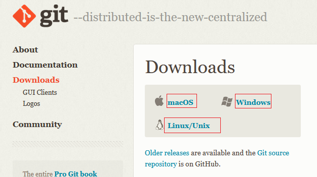

Для **Windows** необходимо скачать установочный exe файл. Сайт git сам подскажет какая версия нужна или можно скачать под определённую архитектуру

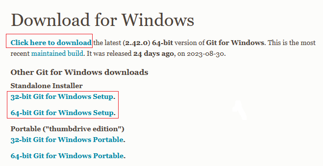

Для Linux или MacOS скачивание идёт через системный терминал по соответствующим 
командам

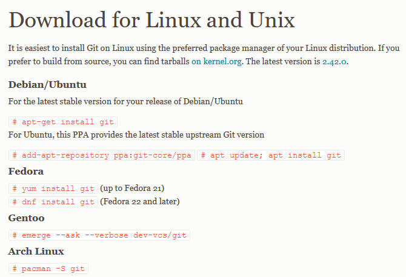

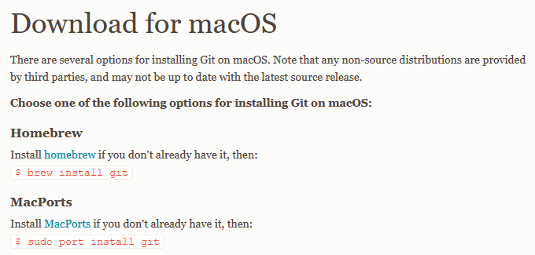

2. Cкопируйте ссылку для клонирования репозитория 

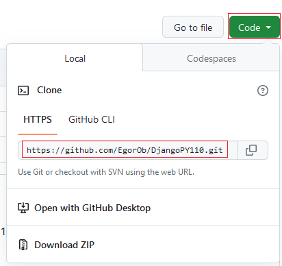

3. Откройте окно клонирования в PyCharm. В вашем проекте PyCharm 
(можно новом проекте, можно уже ранее используемом в курсе PY100)
зайдите в `VCS` (Version Control System, VCS вкладка появится в случае 
правильно установленного git клиента с 1-го шага) и далее `Get from Version Control` 

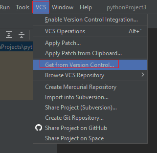

4. Внесите скопированную ранее ссылку в поле `URL` и нажмите кнопку `Clone` 

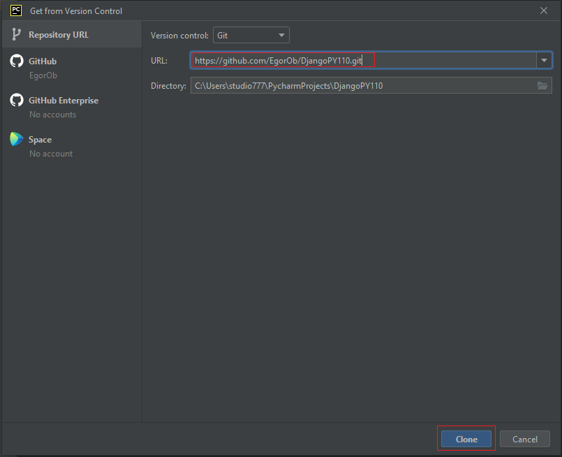

5. Далее появятся окна с вопросами о доверии к загружаемому репозиторию, где нужно нажать `Trust Project`.
Следующее окно будет с выбором места, где раскрыть окно с проектом, в текущем окне, или новом. Выбор за вами.

6. Затем `PyCharm` заметит в проекте файл requirements.txt со списком зависимостей 
проекта и предложит вам загрузить зависимости в ваше окружение. Для упрощения работы согласитесь. 

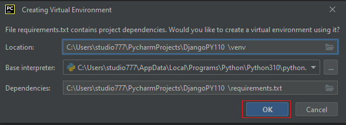

через некоторое время все зависимости подгрузятся. Шаг 7 для тех у кого не получилось 
автоматически загрузить зависимости. Если всё нормально, то переходите к шагу 8. 

7. Если зависимости не подгрузились, допустим из-за блокировок фаервола, то можно 
вручную загрузить зависимости, достаточно в консоле прописать команду 
`pip install -r requirements.txt` (обратите внимание, что для корректной работы 
с проектом у вас должна быть активирована виртуальная среда, для этого в консоле 
должно быть написано `(venv)` у каретки в консоле) 

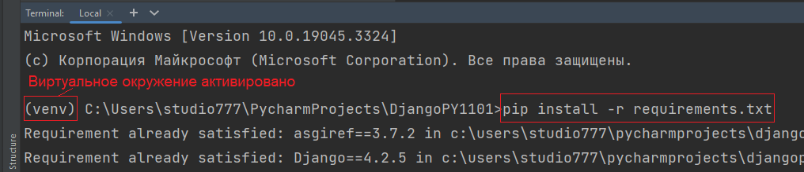

Требование активированной среды гарантирует, что все зависимости установятся в данную среду.

8. Загрузите вспомогательные данные для первой лабораторной работы. Вся ваша работа 
на данном модуле будет проходить в ветке `master`, а по мере продвижения в модуле 
будете сливать новый материал из необходимой ветки с лабораторной работой в `master` ветку.

Слияние можно произвести в PyCharm несколькими способами. Выберете удобный для себя

* Через вкладку `Git`, далее `Merge` и далее выбираем какую ветку будем вливать в `master`
в нашем случае это ветка `origin/lab1`

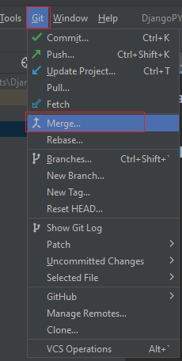

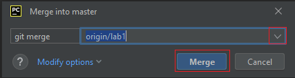

* Другой способ - это использовать панель переключения веток внизу справа в `PyCharm`.
Для этого нажимаем на ветку `master` далее нажимаем на `origin/lab1`, где в 
выпадающем окне выбираем `Merge 'origin/lab1' into 'master'`

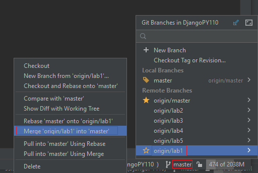

9. После слияния появятся папки `files` и `tasks`. В папке `tasks` в соответствующей 
папке с лабораторной работой (папки в `tasks` с лабораторными работами будут 
подгружаться с вашими последующими слияниями с ветками lab2, lab3, lab4, lab5)
находится файл `task.md` в котором содержатся задания для лабораторной работы.
В папке `files` находится дополнительный материал необходимый для выполнения
лабораторной работы.

10. Откройте файл `task.md` в папке `tasks/lab1` и начните выполнять первую 
лабораторную работу.