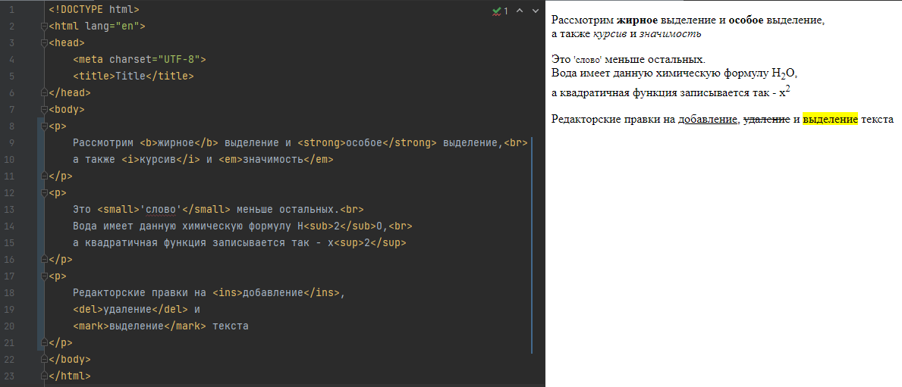

За более подробной информацией можно обратиться в [источник](https://html5book.ru/html-html5/)

Также в дополнение, кому будет мало, то можно почитать часть курса по [web](https://smartiqa.ru/courses/web/lesson-2-html)

[Шпаргалка по тегам HTML](https://html5book.ru/examples/html-tags.html) 

### Элементы для размещения текста

* `<br>` - позволяет сделать перенос текста на следующую строку.

* `<hr>` - используется для разделения контента на веб-странице. Отображается в виде горизонтальной линии.

* `<p>`(`</p>`) - используется для создания абзацев текста на веб-странице. 
Этот тег помогает оформлять и структурировать текст, разделяя его на логические блоки, что делает веб-страницу более 
читаемой и понятной для пользователей. Абзацы — это блоки текста, физически отделенные от смежных блоков пустыми строками.

* `<pre>`(`</pre>`) - позволяет отображать текст с сохранением пробелов и переносами строк так, как он записан в исходном коде. 
Это полезно для отображения программного кода или форматированного текста.

* `<code>`(`</code>`) - используется для обозначения фрагментов программного кода, и текст внутри него обычно отображается с 
моноширинным шрифтом.

Ниже пример с данными тегами:

```html
<pre>
Политех
    Я    помню    чудное      мгновение
</pre>
Политех<br>
    Я    помню    чудное      мгновение
<br><br>
<code>Python is best code language</code>
<br>
<hr>
<br>
<p>У лукоморья дуб зелёный;<p>
<p>Златая цепь на дубе том:<p>
<p>И днём и ночью кот учёный<p>
<p>Всё ходит по цепи кругом;<p>
```


Видно, что шрифт текста не такой, как в нашем IDE, так как у HTML есть стандартные шрифты, чтобы они поддерживались на 
всех устройствах способных работать с HTML. Про теги работы со шрифтами будет рассмотрено позже.

### Заголовочные элементы

Заголовки являются важными элементами веб-страницы, они упорядочивают текст, формируя его визуальную структуру. 
Элементы `<h1>...<h6>` должны использоваться только для выделения заголовков нового раздела или подраздела.

Заголовки удобно использовать, когда нет необходимости точного значения размера шрифта. Размер пропорционален значению `em`.
1 em равен размеру в пикселях, делённому на базовое значение (по умолчанию 16px)


* `<h1>`(`</h1>`) - заголовок самого верхнего уровня, на странице рекомендуется использовать только один раз, 
по возможности частично дублируя заглавие страницы. Элемент `<h1>` должен быть уникальным для каждой страницы сайта. 
Рекомендуется прописывать в начале статьи, используя ключевое слово в тексте заголовка. Размер шрифта в браузере равен `2em`, 
верхний и нижний отступ по умолчанию `0.67em`.


* `<h2>`(`</h2>`) - представляет подзаголовки элемента `<h1>`. Размер шрифта в браузере равен `1.5em`, 
верхний и нижний отступ по умолчанию `0.83em`.


* `<h3>`(`</h3>`) - Показывает подзаголовки элемента `<h2>`. Размер шрифта в браузере равен `1.17em`, верхний и нижний отступ 
по умолчанию `1em`.


* `<h4>`(`</h4>`), `<h5>`(`</h5>`), `<h6>`(`</h6>`) Обозначают подзаголовки четвёртого, пятого и шестого уровня. 
Размер шрифта в браузере равен `1em` / `0.83em` / `0.67em`, верхний и нижний 
отступ по умолчанию `1.33em` / `1.67em` / `2.33em` соответственно.

```html
<h1>Заголовок h1</h1>
<h2>Заголовок h2</h2>
<h3>Заголовок h3</h3>
<h4>Заголовок h4</h4>
<h5>Заголовок h5</h5>
<h6>Заголовок h6</h6>
```


### Элементы для форматирования текста

[Подробнее](https://html5book.ru/semantika-urovnya-teksta)

* `<b>`(`</b>`) - задаёт полужирное начертания шрифта. Выделяет текст без акцента на его важность.


* `<strong>`(`</strong>`) - задаёт полужирное начертание шрифта, относится к элементам логической разметки, указывая браузеру на важность текста.


* `<i>`(`</i>`) - отображает шрифт курсивом.


* `<em>`(`</em>`) - отображает шрифт курсивом, придавая тексту значимость.


* `<small>`(`</small>`) - уменьшает размер шрифта на единицу по отношению к обычному тексту.


* `<sub>`(`</sub>`) - используется для создания нижних индексов. Сдвигает текст ниже уровня строки, уменьшая его размер.


* `<sup>`(`</sup>`) - используется для создания степеней. Сдвигает текст выше уровня строки, уменьшая его размер.


* `<ins>`(`</ins>`) - выделяет текст в новой версии документа, подчёркивая его.


* `<del>`(`</del>`) - перечёркивает текст. Используется для выделения текста, удаленного из документа.


* `<mark>`(`</mark>`) - применяется для выделения фрагментов текста в справочных целях, окрашивая блок символов желтым цветом.

```html
<p>
    Рассмотрим <b>жирное</b> выделение и <strong>особое</strong> выделение,<br>
    а также <i>курсив</i> и <em>значимость</em>
</p>
<p>
    Это <small>'слово'</small> меньше остальных.<br>
    Вода имеет данную химическую формулу H<sub>2</sub>O,<br>
    а квадратичная функция записывается так - x<sup>2</sup>
</p>
<p>
    Редакторские правки на <ins>добавление</ins>, <del>удаление</del> и <mark>выделение</mark> текста
</p>
```


### Элементы работы со списком

[Подробнее](https://html5book.ru/html-lists/)

1. Маркированный список представляет собой неупорядоченный список (от англ. Unordered List). 
Создаётся с помощью элемента `<ul>`. В качестве маркера элемента списка выступает метка, например, закрашенный кружок.

```html
<ul>
  <li>Microsoft</li>
  <li>Google</li>
  <li>Apple</li>
  <li>IBM</li>
</ul>
```


2. Нумерованный список создаётся с помощью элемента `<ol>`. Каждый пункт списка также создаётся с помощью элемента `<li>`. 
Браузер нумерует элементы по порядку автоматически и если удалить один или несколько элементов такого списка, то 
остальные номера будут автоматически пересчитаны.

```html
<ol>
  <li>Microsoft</li>
  <li>Google</li>
  <li>Apple</li>
  <li>IBM</li>
</ol>
```


3. Списки определений создаются с помощью элемента `<dl>`. Для добавления термина применяется элемент `<dt>`, 
а для вставки определения — элемент `<dd>`.

```html
<dl>
  <dt>Директор:</dt>
    <dd>Иван Иванов</dd>
  <dt>Сотрудники:</dt>
    <dd>Петр Петров</dd>
    <dd>Илья Ильин</dd>
    <dd>Максим Максимов</dd>
</dl>
```


4. Вложенный список. Разметка для вложенного списка - это комбинирование списков, например:

```html
<ul>
 <li>Пункт 1.</li>
  <li>Пункт 2.
    <ul>
      <li>Подпункт 2.1.</li>
       <li>Подпункт 2.2.     
        <ul>
          <li>Подпункт 2.2.1.</li>
          <li>Подпункт 2.2.2.</li>
          </ul>
       </li>          
      <li>Подпункт 2.3.</li>
    </ul>
  </li>
 <li>Пункт 3.</li>
</ul>
```


### Элементы работы со таблицей

[Подробнее](https://html5book.ru/tablichnye-dannye/)

Начала будут приведены элементы таблицы, а затем пример с использованием этих элементов.

* `<table>` - представляет табличные данные, то есть информацию, представленную в двумерной таблице, состоящей из строк 
и столбцов ячеек, содержащих данные.

* `<caption>` - участвует в макете таблицы, добавляя заголовок таблице, что значительно упрощает ее понимание.

* `<colgroup>` и его атрибут `span` участвует в макете таблицы, представляя группу из одного или нескольких столбцов.

* `<col>` и его атрибут `span` участвует в макете таблицы, представляя один или несколько столбцов в группе столбцов, 
представленных элементом `<colgroup>`

* `<tbody>` - участвует в макете таблицы, представляя собой блок строк, состоящий из основных данных таблицы.

* `<thead>` - участвует в макете таблицы, представляя собой блок строк, состоящий из заголовков столбцов таблицы.

* `<tfoot>` - участвует в макете таблицы, представляя собой блок строк, состоящий из нижних колонтитулов.

* `<tr>` - участвует в макете таблицы, представляя собой строку ячеек в таблице

* `<td>` - представляет собой ячейку данных в таблице

* `<th>` определяет ячейку как заголовок группы ячеек таблицы

В итоге `<tr>` и `<th>` это группы ячеек, а сами данные в ячейке находятся в `<td>`

Пример таблицы заказа в интернет-магазине. Про используемый атрибут `style` поговорим в разделе кастомизации.

```html
<table>
        <caption>Заказ интернет-магазина</caption>
        <colgroup>
            <col style="width: 20%;">
            <col style="width: 40%;">
            <col style="width: 20%;">
            <col style="width: 20%;">
        </colgroup>
        <thead>
            <tr>
                <th>Номер товара</th>
                <th>Наименование товара</th>
                <th>Цена (USD)</th>
                <th>Количество</th>
            </tr>
        </thead>
        <tbody style="background: lightblue">
            <tr>
                <td>101</td>
                <td>Смартфон</td>
                <td>500</td>
                <td>2</td>
            </tr>
            <tr>
                <td>202</td>
                <td>Ноутбук</td>
                <td>800</td>
                <td>1</td>
            </tr>
            <tr>
                <td>303</td>
                <td>Планшет</td>
                <td>300</td>
                <td>3</td>
            </tr>
        </tbody>
        <tfoot>
            <tr style="background: lightgray">
                <td colspan="2">Итого:</td>
                <td>2700</td>
                <td>6</td>
            </tr>
        </tfoot>
    </table>
```


### Элементы, формирующие разделы HTML-документа

[Подробнее](https://html5book.ru/razdely-dokumenta/)

Разделы своего рода контейнеры, для описания структуры файла. В самих контейнерах уже формируются блоки с основной 
информацией на странице.

* `<body>` - представляет содержимое документа.


* `<article>` - представляет собой законченное или автономное произведение в документе, странице, приложении или сайте.


* `<section>` - представляет общий раздел документа или приложения, группируя тематическое содержимое. Примерами разделов 
могут быть главы, различные страницы во вкладках или пронумерованные разделы. Домашняя страница веб-сайта может быть разбита на разделы для введения, новостей и контактной информации.


* `<nav>` - представляет собой раздел страницы с навигационными ссылками, который ссылается на другие страницы или 
части внутри страницы, при этом необязательно должен находиться внутри `<header>`. На странице может быть несколько элементов `<nav>`.


* `<aside>` - представляет раздел страницы, который состоит из содержимого, косвенно связанного с родительским секционным 
элементом и который можно рассматривать отдельно от него. Чаще всего элемент позиционируется как боковая колонка 
(как в книгах) и включает в себя группу элементов: <nav>, цифровые данные, цитаты, рекламные блоки, архивные записи и т.д.


* `<header>` - представляет вводное содержимое для его ближайшего предка — элемента `<main>` или элемента из категории 
секционного содержимого или корневого секционного элемента. Элемент `<header>` обычно содержит группу вводных или навигационных элементов.


* `<footer>` - представляет нижний колонтитул для его ближайшего предка элемента `<main>`, или элемента из категории 
секционного содержимого или корневого секционного элемента.


В общем виде типовое назначение разделов можно изобразить так


или так


```html

```

### Элементы группировки

[Подробнее](https://html5book.ru/gruppirovka-soderzhimogo/)

Самое время поговорить как можно сгруппировать блок элементов внутри контейнера, это полезно для того, чтобы применять 
какие-то действия для всех элементов внутри этого контейнера, допустим одинаковый шрифт, цвет или другие действия.

* `<div>` - самый часто встречаемый блок группировки, представляет свои дочерние элементы. 
Может использоваться с атрибутами class, lang и title для разметки семантики, общей для группы последовательных элементов.

Рекомендуется использовать элемент `<div>` в случаях, когда другой элемент не подходит. 
Использование более подходящих элементов вместо элемента `<div>` обеспечивает лучшую доступность для читателей и облегчает обслуживание кода.

С другой стороны, элемент `<div>` может быть полезны для стилистических целей или для обертывания нескольких абзацев 
внутри раздела, имеющих общие свойства. 

* `<span>` - не является элементом группировки, но может быть полезен при использовании вместе с глобальными атрибутами, 
например, class, lang или dir. Удобно применять для кастомизации отдельных частей текста.


* `<main>` - включает основное содержимое элемента `<body>` документа или приложения и исключает содержимое, 
которое повторяется на страницах сайта/приложения, таких как ссылки для навигации по сайту, 
информация об авторских правах, логотипы сайта и баннеры, а также поисковые формы (за исключением случаев, когда 
основной функцией документа или приложения является поисковая форма).

В документе должно быть не более одного элемента `<main>`.

* `<address>` - представляет контактную информацию о человеке или организации. 
Он должен включать физическое и / или цифровое местоположение / контактную информацию и средства идентификации лица (лиц) 
или организации, к которой относится эта информация. В браузере обычно отображается курсивом.

* `<blockquote>` - представляет содержимое, цитируемое из другого источника, необязательно со ссылкой на источник цитирования, 
которая указывается в элементе `<footer>` или `<cite>`, и, необязательно, с изменениями по тексту, такими как аннотации и сокращения.

```html
<address>
Санкт-Петербург 195251<br>
ул. Обручевых , д. 1, комн. 202<br>
(11–ый учебный корпус СПбПУ)<br>
Тел.: +7 (812) 703-02-02 | Почта: info@hse.spbstu.ru
</address>

<blockquote>
    <p>От перца, верно, начинают всем перечить... От уксуса - куксятся, от горчицы - огорчаются, от лука - лукавят,
        от вина - винятся, а от сдобы - добреют. Как жалко, что никто об этом не знает... Всё было бы так просто!
        Ели бы сдобу и добрели!</p>
    <cite>Льюис Кэрролл. Приключения Алисы в Стране чудес</cite>
</blockquote>
```


* `<figure>` - представляет автономное содержимое (необязательно с подписью), являющееся самостоятельным элементом 
основного потока. С помощью элемента `<figure>` можно добавлять краткие характеристики к иллюстрациям, фотографиям, 
диаграммам, фрагментам кода и т.д.

* `<figcaption>` - представляет заголовок или легенду для остального содержимого родительского элемента `<figure>`.
```html
<figure>
    
    <figcaption>Осенний лес</figcaption>
</figure>
```


### Атрибуты, кастомизация элементов, работа с цветом и шрифтом и т.д.

Для работы с цветом и шрифтом, да и вообще кастомизацией элементов можно использовать атрибут `style`, где прописать что конкретно изменяете

Атрибуты прописываются внутри открытого элемента после его названия и до закрытия скобки `>`

Допустим 

```html
<p style="color: red;">
    Этот текст будет красным, а тут <b>жирно красным</b>
</p>
<p style="font-family: Arial, sans-serif; font-size: 26px;">
    Этот текст будет в шрифте Arial размером 26px.
</p>
<p style="font-family: Arial, sans-serif; font-size: 26px;">
    Внутри также можно менять элементы, если они поддерживают атрибуты.
    Допустим как
    <span style="color: green;">H</span>
    <sub style="color: red;">2</sub>
    <span style="color: orange;">O</span>
</p>
```


Также есть элемент `<style>`(`</style>`) в который можно записать все стили элементов,
внутри можно более полноценно кастомизировать элементы и ссылаться на них. Однако,
при большом числе стилей, рекомендуется данные стили выносить в отдельный файл css, 
а затем этот css подгружать в файл HTML.

Пример использования элемента `<style>`

```html

```


### Элементы встраиваемого содержимого, работа с картинками, видео, аудио

*Работа с картинками*

Подробнее про [картинки](https://html5book.ru/images-in-html/)

* `` - представляет изображение и его резервный контент, который добавляется с помощью атрибута `alt`. 
Так как элемент `` является строчным, то рекомендуется располагать его внутри блочного элемента, например, `<p>` или `<div>`.

Элемент `` имеет обязательный атрибут `src`, значением которого является абсолютный или относительный путь к изображению

```html
<p>
    
</p>
```
* `<map>` - служит для представления графического изображения в виде карты с активными областями. 
Активные области определяются по изменению вида курсора мыши при наведении. Щелкая мышью на активных областях, 
пользователь может переходить к связанным документам.

* `<area>` - описывает только одну активную область в составе карты изображений на стороне клиента. 
Если одна активная область перекрывает другую, то будет реализована первая ссылка из списка областей.

*Пример создания карты изображений*


Можете подставить код в `example.html` и посмотреть, что выйдет

```html

<map name="flowers">
<area shape="circle" coords="70,164,50" href="https://ru.wikipedia.org/wiki/Гербера" alt="gerbera" target="_blank">
<area shape="poly" coords="191,13,240,98,143,98,191,13" href="https://ru.wikipedia.org/wiki/%C3%E8%E0%F6%E8%ED%F2" alt="hyacinth" target="_blank">
<area shape="circle" coords="318,93,50" href="https://ru.wikipedia.org/wiki/Ромашка" alt="camomiles" target="_blank">
<area shape="circle" coords="425,129,45" href="https://ru.wikipedia.org/wiki/Нарцисс_(растение)" alt="narcissus" target="_blank">
<area shape="rect" coords="480,3,572,89" href="https://ru.wikipedia.org/wiki/Тюльпан" alt="tulip" target="_blank">
</map>
```

*Работа с видео*

Подробнее про [видео](https://html5book.ru/html5-video/)

В простом варианте HTML-разметка для размещения видеофайла на странице имеет следующий вид:

```html
<video src="video.ogv" controls></video> 
```
Атрибут `controls` отвечает за появление элементов управления видеоплеером. Вы можете добавить изображение с помощью 
атрибута `poster`, которое браузер будет использовать, пока загружается видео или пока пользователь не нажмет на кнопку 
воспроизведения, а также задать высоту и ширину видео.

*Работа со звуком*

Подробнее про [аудио](https://html5book.ru/html5-audio/)

HTML5-элемент `<audio>` используется для внедрения звукового контента в веб-страницы. В общем виде HTML-разметка 
имеет следующий вид:

```html
<audio src="name.ogg" controls></audio>
```
Атрибут controls добавляет отображение браузерами интерфейса управления аудио плеера — кнопки воспроизведения, паузы, громкости.

*Контейнеры для встраиваемого содержимого*

Подробнее про [встраиваемое содержимое](https://html5book.ru/vstraivaemoe-soderzhimoe/)

* `<picture>`(`</picture>`) вместе с элементом `<source>` может использоваться для предоставления множественных источников изображения. 
Это дает браузеру возможность выбора оптимальной версии изображения, в зависимости от плотности пикселей экрана, 
размера области просмотра, формата изображения и других факторов. Если наиболее подходящей версии изображения среди 
элементов <source> найдено не будет, то будет отображен файл, указанный в резервном элементе .

```html
<picture>
  <source media="(min-width: 800px)"
          sizes="80vw"
          srcset="lighthouse-landscape-640.jpg 640w,
                  lighthouse-landscape-1280.jpg 1280w,
                  lighthouse-landscape-2560.jpg 2560w">
        
</picture>
```

* `<iframe>`(`</iframe>`) - используется для встраивания другого HTML-документа в текущий, при этом он полностью изолирован от 
JavaScript и CSS родительского элемента.

```html
<iframe sandbox="allow-forms allow-modals" 
        allow="fullscreen" 
        src="https://youtu.be/">
</iframe>
```


* `<embed>` - используется для отображения внешних ресурсов или интерактивного контента. Элемент `<embed>` не подключает 
альтернативные ресурсы. Если браузер не находит подходящий плагин при попытке найти и создать экземпляр ресурса, 
то он выдаст сообщение о неподдерживаемом формате.

```html
<embed src="catgame.swf">
```


* `<object>`(`</object>`) - представляет внешний ресурс, который, в зависимости от типа ресурса, будет рассматриваться либо как 
изображение, либо как вложенный контекст просмотра, либо как внешний ресурс, который будет обрабатываться плагином.

```html
<object type="application/x-shockwave-flash">
    <param name="movie" value="https://video.example.com/library/watch.swf">
    <param name="allowfullscreen" value="true">
    <param name="flashvars" value="https://video.example.com/vids/123456">
    <video controls src="https://video.example.com/vids/123456"
      <a href="https://video.example.com/vids/123456">View video</a>
    </video>
</object>
```

* `<param>` - определяет параметры плагинов, вызываемых элементом `<object>`


### Ссылки
Подробнее про [ссылки](https://html5book.ru/ssylki/)

Ссылки представляют связь между двумя ресурсами, одним из которых является 
текущий документ.
В HTML есть два вида ссылок:

* `Ссылки на внешние ресурсы` — это ссылки на ресурсы, которые должны использоваться 
для дополнения текущего документа (метаданные), обычно автоматически обрабатываемые браузером.
Ссылку на внешний объект создают с использованием элемента `<link>`.


* `Гиперссылки` — это ссылки на другие ресурсы, которые пользователь может посещать в браузере или загружать.
Гиперссылки чаще создают с использованием элемента `<a>`, однако в качестве ссылки можно использовать любой элемент 
у которого есть атрибут `href`.

*Гиперссылка*

`<a>`(`</a>`) - создаёт ссылку для перехода на нужный адрес. Для перехода необходимо нажать на текст ссылки

Если элемент `<a>` имеет атрибут `href`, то он представляет собой гиперссылку 
(ссылку на другой ресурс, к которому можно перейти или скачать) или якорь 
(ссылку на идентификатор фрагмента, который является значением в атрибуте id элемента в связанном документе).

Элемент `<a>` может быть обернут вокруг целых абзацев, списков, таблиц и т. д., 
даже целых разделов, при условии, что внутри отсутствует интерактивный контент 
(например, кнопки или другие ссылки).

```html
<aside class="advertising">
    <h2>Викиум</h2>
    <a href="https://ru.wikipedia.org">
        <section>
            <h3>Тренажеры для мозга</h3>
            <p>Какая функция мозга у тебя сильнее?</p>
        </section>
    </a>
</aside>
```

Атрибуты `<a>`:
* `href` - Задает адрес гиперссылки.
* `target` - Устанавливает контекст просмотра по умолчанию для навигации по гиперссылкам.
* `download` - Определяет, скачивать ли целевой ресурс вместо перехода на него.
* `rel` -	Устанавливает отношение текущего документа (или подраздела / темы) с целевым.
* `rev` -	Устанавливает обратную связь отношения целевой страницы с текущим документом (или подразделом / темой).
* `hreflang` - Описывает язык целевого ресурса.
* `type` - Добавляет подсказку для типа ссылочного ресурса.
* `referrerpolicy` - Устанавливает политику HTTP-заголовка — количество информации об исходной странице, с которой осуществлен переход на целевую страницу.

*Ссылка на внешний ресурс*

`<link>` определяет отношение между текущей страницей и другими документами. 
Таких элементов на странице может быть несколько.

Пример подгрузки HTML стилей
```html
<link rel="stylesheet" href="style.css" type="text/css">
```
Атрибуты `<link>` (чаще всего будете встречаться с `href` и `rel`):

* `crossorigin` - Указывает, должен ли использоваться CORS (технология браузеров, которая позволяет предоставить веб-странице доступ к ресурсам другого домена) при извлечении изображения с сайта.


* `hreflang` - Определяет язык текста в документе, на который идет ссылка.


* `media` - Определяет тип устройства, к которым должен быть применен ресурс ссылки.


* `nonce` -	Генерируемая случайным образом на сервере строковая переменная, которая устанавливает правила использования встроенных стилей с целью защиты контента.


* `rel` - Атрибут определяет отношения между текущим документом и документом, на который идет ссылка. Ниже возможные значения:
  * `alternate` — ссылка на тот же документ, но в другом формате (например, страницы для печати, перевод, зеркало, лента в формате RSS или Atom)
  * `archives` — указывает на то, что документ по ссылке представляет исторический интерес. Ссылка может указывать на коллекцию записей, документов и других материалов.
  * `author` - ссылка на страницу об авторе документа или на страницу с контактными данными автора.
  * `bookmark` - ссылка на ближайшего предка статьи, являющегося связующим звеном, или на раздел статьи, наиболее тесно связанных с элементом, если нет предка.
  * `external` - используется для указания того, что страница на которую ведет ссылка не являются частью данного сайта.
  * `first` - указывает ссылку, ведущую на первый документ из последовательности документов.
  * `help` - ссылка на документ со справкой.
  * `icon` - определяет путь к иконке, которая будет использована для текущего документа.
  * `last` - указывает ссылку, ведущую на последний документ в последовательности документов.
  * `license` - ссылка на сведения об авторских правах для документа.
  * `next` - указывает, что этот документ является частью серии, и что ссылка ведет на следующий документ в этой серии.
  * `nofollow` - указывает на то, что ссылка не одобрена автором страницы или что ссылка носит коммерческий характер.
  * `noreferrer` - указывает на то, что заголовок запроса клиента, содержащий url источника запроса, не должен передаваться при переходе по ссылке.
  * `pingback` - указывает адрес пингбэк-сервера, что дает возможность для блога автоматически оповещать сайты, ссылающиеся на него.
  * `prefetch` - указывает, что следует заранее кэшировать файл, на который ведет ссылка.
  * `prev` - указывает, что этот документ является частью серии, и что ссылка ведет на предыдущий документ в этой серии.
  * `search` - указывает, что ссылаемый документ содержит интерфейс поиска и связанных с ним ресурсов.
  * `sidebar` - указывает, что ссылаемый документ, если это возможно, будет показан в дополнительном контексте браузера, и некоторые браузеры при щелчке по гиперссылке открывают окно для добавления ссылки в панель закладок.
  * `stylesheet` - ссылка на внешний файл, который будет использоваться в качестве таблицы стилей для данного документа.
  * `tag` - указывает на то, что метка, на которую ведет гиперссылка, относится к данному документу.
  * `up` - указывает, что страница является частью иерархической структуры, и что гиперссылка ведет на более высокий уровень ресурса в структуре.
* `sizes` - Указывает размер иконок для визуального отображения. Атрибут sizes используется только совместно с rel="icon", и может принимать следующий значения:
* `title` - Определяет заголовок ссылки или название набора альтернативных таблиц стилей. Значение атрибута — текст.
* `type` - Определяет MIME-тип документа, на который идет ссылка. В данном случае он принимает значение "text/css".


### Интерактивные элементы
Подробнее про [интерактивные элементы](https://html5book.ru/interaktivnye-elementy/)

* `<details>` - представляет виджет раскрытия информации, который используется, 
чтобы показать или скрыть дополнительную информацию в конкретной области интерфейса. 
Не подходит для примечаний. 

* `<summary>` - представляет заголовок или небольшое пояснение для остального 
содержимого родительского элемента `<details>`. Щелчок по элементу `<summary>` 
переключает состояние родительского элемента в открытое и закрытое состояния.

```html
<details>
  <summary><label for="fn">Name & Extension:</label></summary>
  <p><input type="text" id="fn" name="fn" value="Pillar Magazine.pdf">
  <p><label><input type="checkbox" name="ext" checked> Hide extension</label>
</details>
```


* `<dialog>` - представляет примитив графического интерфейса — диалоговое окно, 
с которым пользователь взаимодействует для выполнения конкретных задач.

Элемент `<dialog>` с помощью атрибута `method="dialog"` может интегрироваться с элементом `<form>`

```html
<dialog id="favDialog">
   <form method="dialog">
      <p>
         <label for="favAnimal">Любимые животные:</label>
         <select id="favAnimal">
            <option></option>
            <option>Вельш-корги</option>
            <option>Красная панда</option>
            <option>Рэгдолл</option>
         </select>
      </p>
      <p>
         <button id="cancel" type="reset">Отменить</button>
         <button type="submit">Отправить</button>
      </p>
   </form>
</dialog>
```

### Формы
Подробнее про [формы](https://html5book.ru/html5-forms/)

HTML-формы являются элементами управления, которые применяются для сбора информации от посетителей веб-сайта.


### Атрибуты использующие сценарии
Подробнее про [сценарии](https://html5book.ru/skripty/)

`<script>` - позволяет присоединять к документу различные сценарии написанные на javascript.
Текст сценария может располагаться либо внутри этого элемента, либо во внешнем файле. 
Если текст сценария расположен во внешнем файле, то он подключается с помощью 
атрибутов элемента.

Атрибуты `<script>`:
* `async` - Атрибут указывает на то, что сценарий будет выполняться асинхронно с остальной частью страницы (сценарий начнет выполняться одновременно с загрузкой страницы).


* `charset` - Определяет кодировку символов


* `crossorigin` - Определяет, будет ли использоваться CORS при загрузке внешних скриптов (с использованием атрибута src).


* `defer` - Интерпретация сценариев откладывается до окончания отображения документа на устройстве пользователя.


* `nonce` - Обеспечивает безопасность, защищая от атак с внедрением межсайтового скриптинга (XSS, cross site scripting). 
Устанавливает правила использования встроенных скриптов с помощью nonce-значений и хэшей. Во время рендеринга страницы браузер 
для каждого инлайн-скрипта вычисляет хэши и сравнивает с перечисленными в CSP. Загрузка с ресурсов, не входящих в «белый список», блокируется.


* `src` - Указывает на месторасположение файла со сценарием, значение атрибута — это url файла, содержащего JavaScript-программу.


* `type` - Используются для объявления языка сценария, использованного при составлении содержимого элемента.

`<template>` - используется для объявления фрагментов HTML-разметки, которые можно 
клонировать и вставлять в документ с помощью сценария. 
При загрузке страницы элемент `<template>` не отображается.

`<canvas>` - определяет пустую растровую область для рисования. Он не имеет 
собственных объектов, только инструкции Canvas API о том, что рисовать на любом отдельном кадре. 
Canvas API в основном ориентирован на 2D-графику. Его можно использовать для рисования графики, 
анимации, игровой графики, визуализации данных, обработки фотографий и видео в реальном времени.

Пример работы сценариев и `<canvas>` позволяющего нарисовать анимацию:

```html
<style>
    body {
  overflow: hidden;
  margin: 0;
  padding: 0;
  background: hsla(242, 30%, 5%, 1);
}

canvas {
  width: 100%;
}
</style>

<canvas id='canv'></canvas>

<script>
window.requestAnimFrame = (function() {
  return window.requestAnimationFrame ||
    window.webkitRequestAnimationFrame ||
    window.mozRequestAnimationFrame ||
    window.oRequestAnimationFrame ||
    window.msRequestAnimationFrame ||
    function(callback) {
      window.setTimeout(callback, 1000 / 60);
    };
})();
window.addEventListener('load', start, false);

var c,
  $,
  w,
  h,
  msX,
  msY,
  midX,
  midY,
  num = 650,
  parts = [],
  begin = 50,
  repeat = 20,
  end = Math.PI * 2,
  force = null,
  msdn = false;

function start() {
  c = document.getElementById('canv');
  $ = c.getContext('2d');
  w = c.width = window.innerWidth;
  h = c.height = window.innerHeight;
  midX = w / 2;
  midY = h / 2;
  force = Math.max(w, h) * 0.09;
  flow = begin;

  window.requestAnimFrame(create);
  run();
}

function run() {
  window.requestAnimFrame(run);
  go();
}

function Part() {
  this.deg = 0;
  this.rad = 0;
  this.x = 0;
  this.y = 0;
  this.distX = 0;
  this.distY = 0;
  this.color = 'rgb(' + Math.floor(Math.random() * 130) + ',' + Math.floor(Math.random() * 50) + ',' + Math.floor(Math.random() * 100) + ')';
  this.size;
}

function create() {
  var n = num;
  while (n--) {
    var p = new Part();
    p.deg = Math.floor(Math.random() * 360);
    p.rad = Math.floor(Math.random() * w * 0.5);
    p.x = p.distX = Math.floor(Math.random() * w);
    p.y = p.distY = Math.floor(Math.random() * h);
    p.size = 1 + Math.floor(Math.random() * (p.rad * 0.055));
    parts[n] = p;
  }
  c.onmousemove = msmv;
  c.onmousedown = msdn;
  c.onmouseup = msup;

  var int = setInterval(function() {
    flow--;
    if (flow === repeat) clearInterval(int);
  }, 20);
}

function go() {
  $.globalCompositeOperation = 'source-over';
  $.fillStyle = 'hsla(242, 30%, 5%, .55)';
  $.fillRect(0, 0, w, h);
  $.globalCompositeOperation = 'lighter';
  var mx = msX;
  var my = msY;
  var bounds = force;
  if (msdn) {
    bounds = force * 2;
  }
  var n = num;
  while (n--) {
    var p = parts[n];
    var radi = Math.PI / 180 * p.deg;
    p.distX = midX + p.rad * Math.cos(radi);
    p.distY = midY + p.rad * Math.sin(radi) * 0.4;
    if (mx && my) {
      var react = Math.floor((bounds * 0.5) + Math.random() * (bounds * 0.9));
      if (p.distX - mx > 0 &&
        p.distX - mx < bounds &&
        p.distY - my > 0 &&
        p.distY - my < bounds) {
        p.distX += react;
        p.distY += react;
      } else if (p.distX - mx > 0 &&
        p.distX - mx < bounds &&
        p.distY - my < 0 &&
        p.distY - my > -bounds) {
        p.distX += react;
        p.distY -= react;
      } else if (p.distX - mx < 0 &&
        p.distX - mx > -bounds &&
        p.distY - my > 0 &&
        p.distY - my < bounds) {
        p.distX -= react;
        p.distY += react;
      } else if (p.distX - mx < 0 &&
        p.distX - mx > -bounds &&
        p.distY - my < 0 &&
        p.distY - my > -bounds) {
        p.distY -= react;
        p.distY -= react;
      }
    }
    p.x += ((p.distX - p.x) / flow);
    p.y += ((p.distY - p.y) / flow);
    var x = p.x;
    var y = p.y;
    var s = p.size * (p.y * 1.5 / h);
    if (s < 0.1) {
      s = 0;
    }
    $.beginPath();
    $.fillStyle = p.color;
    $.arc(x, y, s, 0, end, true);
    $.fill();
    $.closePath();
    var vary;
    if (p.size < 2) {
      vary = 4;
    } else if (p.size < 3) {
      vary = 3;
    } else if (p.size < 4) {
      vary = 2;
    } else {
      vary = 1;
    }
    vary *= (p.y / (h * 0.9));
    p.deg += vary;
    p.deg = p.deg % 360;
  }
}

function msmv(e) {
  var p = getPos(e.target);
  var sX = window.pageXOffset;
  var sY = window.pageYOffset;
  msX = e.clientX - p.x + sX;
  msY = e.clientY - p.y + sY;
}

function msdn(e) {
  msdn = true;
}

function msup(e) {
  msdn = false;
}

function getPos(el) {
  var cosmo = {};
  cosmo.x = el.offsetLeft;
  cosmo.y = el.offsetTop;
  while (el.offsetParent) {
    el = el.offsetParent;
    cosmo.x += el.offsetLeft;
    cosmo.y += el.offsetTop;
  }
  return cosmo;
}
</script>
```


### Применение каскадных стилей CSS

Осталось разобрать то, что позволяет изменять любой элемент в HTML.

Атрибутов и возможностей в CSS достаточно много, рассмотрим только подходы, 
остальное, если необходимо, изучите [самостоятельно](https://html5book.ru/css-css3/)
