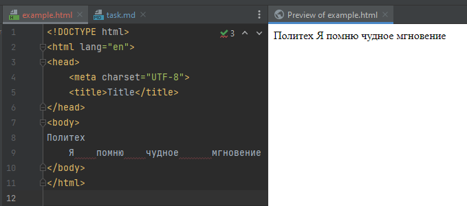

Руководство и задания к 1-ой практике

Создадим файл `weather_api.py`

Получение ключа для API будем производить через сервис https://www.weatherapi.com/ 

Регистрируемся, если не зарегистрированы https://www.weatherapi.com/signup.aspx и подтверждаем почту

После регистрации автоматически появится версия Pro+ на 14 дней, если планируете продолжить пользоваться, то можно перейти
на бесплатную базовую версию.

Для работы будет необходим API ключ, который находится во вкладке `Dashboard`

Общая информация по использованию API погоды описана в https://yandex.ru/dev/weather/doc/dg/concepts/about.html

Необходимо зайти под аккаунтом яндекса и перейти в кабинет разработчика, где подключим `API Яндекс.Погоды`

https://developer.tech.yandex.ru/

Далее заполняем форму, бесплатного тарифа в 50 запросов в день будет достаточно

Переходим в кабинет разработчика и используем предложенный ключ API

По умолчанию тариф будет стоять Тестовый. Если есть необходимость его можно понизить до «Погода на вашем сайте» у кнопки
Тарифы

Как использовать API описано в https://yandex.ru/dev/weather/doc/dg/concepts/forecast-info.html

response = requests.get('https://api.weather.yandex.ru/v2/forecast?lat=55.75396&lon=37.620393', headers={"X-Yandex-API-Key": "54d73608-c8dd-4c98-b18f-d9a5056525ab"})

curl -H "X-Yandex-API-Key: 54d73608-c8dd-4c98-b18f-d9a5056525ab" "https://api.weather.yandex.ru/v2/forecast?lat=55.75396&lon=37.620393"
