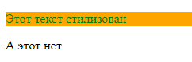

Руководство и задания к 1-ой практике. На практике поработаем с запросами и потренируемся с HTML версткой.

### 1. Работа с запросами к сервису погоды

Будем рассматривать 2 подхода к использованию ключа API сервиса погоды.

#### 1.1 Использование ключа в параметрах запроса

Получение ключа для API будем производить через сервис https://www.weatherapi.com/ 

Регистрируемся, если не зарегистрированы https://www.weatherapi.com/signup.aspx и подтверждаем почту

После регистрации автоматически появится версия Pro+ на 14 дней, если планируете продолжить пользоваться, то можно перейти
на бесплатную базовую версию.

Для создания запросов к сервису будет необходим API ключ, который находится во вкладке `Dashboard`


Примеры запросов можно посмотреть в документации https://www.weatherapi.com/docs/

##### *Создание запросов через адресную строку браузера*

Чаще всего доступ к API идёт через параметры запроса, то возвращаемую информацию можно посмотреть через браузер

Вот пример запроса к данному сервису 

`https://api.weatherapi.com/v1/current.json?key=<YOUR_API_KEY>&q=London`

здесь:
* `key` - ваш ключ доступа
* `q` - локация, где необходимо получить данные. Локацию можно задавать как именем города, так и координатами широта, 
долгота (`q=<lat>,<lon>`), как пример `q=51.52,-0.11`

##### Самостоятельно

Через браузер получите данные о погоде с использованием вашего ключа и желаемой области

Ниже приведен пример запроса для получения данных о погоде для Санкт-Петербурга

`https://api.weatherapi.com/v1/current.json?key=b4588e45fcc14bdb89d63200232109&q=59.93,30.31`


##### *Создание запросов через команду curl*

Также можно использовать команду `curl` в консоли, чтобы получить информацию от сайта. Для корректной работы необходимо
адрес обернуть в кавычки.

```cmd
curl "https://api.weatherapi.com/v1/current.json?key=b4588e45fcc14bdb89d63200232109&q=59.93,30.31"
```


##### *Создание запросов через модуль requests*

У Python есть сторонний модуль requests для работы с запросами. Сделаем запрос с использованием Python console PyCharm

```python
import requests

key = "b4588e45fcc14bdb89d63200232109"  # ваш ключ к API
lat = "59.93"  # широта в градусах
lon = "30.31"  # долгота в градусах

url = f"https://api.weatherapi.com/v1/current.json?key={key}&q={lat},{lon}"
response = requests.get(url)  # отправление GET запроса и получение ответа от сервера
print(response.json())  # получение JSON из ответа
```


#### 1.2 Использование ключа в заголовке запроса

В этот раз воспользуемся сервисом Яндекса

Необходимо зайти под аккаунтом яндекса и перейти в кабинет разработчика https://developer.tech.yandex.ru/, 
где подключим `API Яндекс.Погоды`


Далее заполняем форму, бесплатного тарифа в 50 запросов в день будет достаточно


Переходим в кабинет разработчика и используем предложенный ключ API


По умолчанию тариф будет стоять Тестовый. Если есть необходимость его можно понизить до «Погода на вашем сайте» у кнопки
Тарифы

Как использовать API описано в https://yandex.ru/dev/weather/doc/dg/concepts/forecast-info.html

##### *Создание запросов через адресную строку браузера*

Обратимся к API через адресную строку

`https://api.weather.yandex.ru/v2/forecast?lat=59.93&lon=30.31`

И получим, что нет доступа, так как ключ к API необходимо передавать через заголовок, а через адресную строку это 
передать не выйдет


##### *Создание запросов через команду curl*
 
У curl есть параметр `-H` отвечающий за формирование заголовка в запросе. У сервиса яндекс погоды есть требование как 
должен называться заголовок в котором будет передаваться ключ в общем виде это `X-Yandex-API-Key: <значение ключа>`

Пример запроса

`curl -H "X-Yandex-API-Key: 54d73608-c8dd-4c98-b18f-d9a5056525ab" "https://api.weather.yandex.ru/v2/forecast?lat=59.93&lon=30.31"`


##### *Создание запросов через модуль requests*

Для работы с заголовками у `requests` есть параметр `headers` в который в виде словаря передаются заголовки и их значения

```python
import requests

key = "54d73608-c8dd-4c98-b18f-d9a5056525ab"  # ключ вашего API
lat = "59.93"  # широта в градусах
lon = "30.31"  # долгота в градусах

url = f"https://api.weather.yandex.ru/v2/forecast?lat={lat}&lon={lon}"
headers={"X-Yandex-API-Key": f"{key}"}

response = requests.get(url, headers=headers)
print(response.json())
```


#### 1.3 Самостоятельно 

В корне проекта создайте файл `weather_api.py`. Далее git предложит добавить файл в систему индексации git 
(для отслеживания изменений в данном файле). Добавим этот файл нажав на `Add` 


Если по каким-то причинам файл не добавился (название файла горит красным цветом), то можно это сделать вручную, для этого
правой кнопкой мыши щелкните на файле далее `Git` далее `Add`


В случае добавления файла в систему индексации, то имя файла будет гореть зелёным


В файле `weather_api.py` создайте функцию `current_weather` (пример функции есть ниже) с входными переменными широты и долготы. 
Функция должна возвращать словарь(рядом с описанием написаны ключи по которым можно получить данные из возвращаемого JSON
соответствующего API): 

| Ключ  возвращаемого словаря                                           | Получение значения из API Яндекс Погода                                                                                                                            | Получение значения из API weatherapi                                                                                                                                                               |
|-----------------------------------------------------------------------|--------------------------------------------------------------------------------------------------------------------------------------------------------------------|----------------------------------------------------------------------------------------------------------------------------------------------------------------------------------------------------|
| `city` (город)                                                        | `['geo_object']['locality']['name']`                                                                                                                               | `['location']['name']`                                                                                                                                                                             |
| `time` (время когда было обновление информации) <br/>[формат час:мин] | `['fact']['uptime']` - возвращает время в целом значении секунд, для перевода к формату datetime можно воспользоваться методом `fromtimestamp` подробнее в примере | `['current']['last_updated']`                                                                                                                                                                      |
| `temp` (температура) [градус Цельсия]                                 | `['fact']['temp']`                                                                                                                                                 | `['current']['temp_c']`                                                                                                                                                                            |
| `feels_like_temp` (ощущаемая температура) [градус Цельсия]            | `['fact']['feels_like']`                                                                                                                                           | `['current']['feelslike_c']`                                                                                                                                                                       |
| `pressure` (давление) [мм. ртутного столба]                           | `['fact']['pressure_mm']`                                                                                                                                          | `['current']['pressure_mb']` - возвращает давление в ГПа, необходимо перевести в мм. ртутного столба, для этого давление необходимо умножить на 0.75, результат округлить до 1 знака после запятой |
| `humidity` (влажность) [%]                                            | `['fact']['humidity']`                                                                                                                                             | `['current']['humidity']`                                                                                                                                                                          |
| `wind_speed` (скорость ветра) [м/с]                                   | `['fact']['wind_speed']`                                                                                                                                           | `['current']['wind_kph']` -  возвращает скорость в км/ч необходимо перевести в м/с, для этого скорость нужно поделить на 3.6, результат округлить до 1 знака после запятой                         |
| `wind_gust` (порывы ветра) [м/с]                                      | `['fact']['wind_gust']`                                                                                                                                            | `['current']['gust_kph']` - возвращает скорость порывов в км/ч, необходимо перевести в м/с, результат округлить до 1 знака после запятой)                                                          |
| `wind_dir` (направление ветра)                                        | `['fact']['wind_dir']` - возвращает латинское обозначение направления с *маленькой* буквы                                                                          | `['current']['wind_dir']` - возвращает латинское обозначение направления с *большой* буквы                                                                                                         |


Направление ветра привести к читаемому виду на русском языке, ниже таблица перевода


Для упрощения приведён словарь

```python
DIRECTION_TRANSFORM = {
    'n': 'северное',
    'nne': 'северо - северо - восточное',
    'ne': 'северо - восточное',
    'ene': 'восточно - северо - восточное',
    'e': 'восточное',
    'ese': 'восточно - юго - восточное',
    'se': 'юго - восточное',
    'sse': 'юго - юго - восточное',
    's': 'южное',
    'ssw': 'юго - юго - западное',
    'sw': 'юго - западное',
    'wsw': 'западно - юго - западное',
    'w': 'западное',
    'wnw': 'западно - северо - западное',
    'nw': 'северо - западное',
    'nnw': 'северо - северо - западное',
    'c': 'штиль',
}
```

Данные погоды взять из одного из предложенных выше API погоды. 

Входные и выходные переменные должны быть аннотированы. Должно быть описание функции.

В блоке `if __name__ == '__main__'` проверить работоспособность функции.

Кто хочет, тот может реализовать две функции на разных API, чтобы посмотреть, как отличаются данные разных сервисов.

Функция `current_weather` будет использована в следующей лабораторной работе.

Пример функции `current_weather` для API Яндекс Погода

```python
import requests
from datetime import datetime

DIRECTION_TRANSFORM = {
    'n': 'северное',
    'nne': 'северо - северо - восточное',
    'ne': 'северо - восточное',
    'ene': 'восточно - северо - восточное',
    'e': 'восточное',
    'ese': 'восточно - юго - восточное',
    'se': 'юго - восточное',
    'sse': 'юго - юго - восточное',
    's': 'южное',
    'ssw': 'юго - юго - западное',
    'sw': 'юго - западное',
    'wsw': 'западно - юго - западное',
    'w': 'западное',
    'wnw': 'западно - северо - западное',
    'nw': 'северо - западное',
    'nnw': 'северо - северо - западное',
    'c': 'штиль',
}

def current_weather(lat, lon):
    """
    Описание функции, входных и выходных переменных
    """
    token = 'Ваш токен'
    url = f"https://api.weather.yandex.ru/v2/forecast?lat={lat}&lon={lon}"
    headers = {"X-Yandex-API-Key": f"{token}"}
    response = requests.get(url, headers=headers)
    data = response.json()

    direction_transform = {
        'nw': 'северо - западное',
        'n': 'северное',
        'ne': 'северо - восточное',
        'e': 'восточное',
        'se': 'юго - восточное',
        's': 'южное',
        'sw': 'юго - западное',
        'w': 'западное',
        'c': 'штиль',
    }

    result = {
        'city': data['geo_object']['locality']['name'],
        'time': datetime.fromtimestamp(data['fact']['uptime']).strftime("%H:%M"),
        'temp': 'реализация',
        'feels_like_temp': 'реализация',
        'pressure': 'реализация',
        'humidity': 'реализация',
        'wind_speed': 'реализация',
        'wind_gust': 'реализация',
        'wind_dir': DIRECTION_TRANSFORM.get(data['fact']['wind_dir']),
    }
    return result


if __name__ == "__main__":
    print(current_weather(59.93, 30.31))
```


### 2. Создание коммитов и отправление изменений на github

Создадим коммит наших изменений проекта (реализация `weather_api.py`)

Для этого нажимаем на зеленую галочку вверху справа `PyCharm` или во вкладке `Git` нажимаем `Commit`


Далее появится форма, где можно будет посмотреть те изменения, которые вы хотите зафиксировать в системе контроля версий.

Назовите коммит и нажмите `Commit`


Название файла `weather_api.py` перестало как-то светиться, значит коммит с этим файлом был сформирован.


Процедура создания коммитов необходима для добавления изменений в систему контроля версий, однако, данные изменения есть
на вашей локальной машине, чтобы перенести эти изменения на сервер `github`, то воспользуемся процедурой `Push`.

Для этого нажмём на зелёную стрелку вверху справа `PyCharm` или во вкладке `Git` нажимаем `Push`


Откроется окно с информацией от коммитах, что собираетесь передать. Для передачи нажмём на `Push`


Теперь ваш коммит есть на `github`, а значит и весь тот код, что написали в `weather_api.py` - теперь есть на `github`

### 3. Работа с HTML файлами и вёрсткой

В данной части практики рассмотрим создание и заполнение HTML5, а так же работу с каскадными стилями CSS. 

В модуле P110 будут рассмотрены основные элементы и атрибуты HTML для понимания HTML файлов.
Наша задача научиться понимать файл HTML, а не уметь его создавать с нуля.

Подробно про HTML с его элементами и атрибутами можно прочитать [здесь](https://html5book.ru/html-html5/)

#### *Работа с HTML в PyCharm*

Создайте HTML файл `example.html` через обозреватель `PyCharm` в вашей корневой папке проекта. Почему через `PyCharm`?
`PyCharm` автоматически подготовит простейшую структуру `HTML` файла.


Структура документа HTML созданного PyCharm


Ниже немного рассказано об элементах `example.html`:

* `<!DOCTYPE html>`: Объявление типа документа и начало HTML5-документа.

* `<html>`: Корневой элемент HTML-документа, который охватывает все содержимое страницы.

* `<head>`: Секция, содержащая метаданные и ссылки на внешние ресурсы, такие как стили, скрипты и мета-теги.

* `<meta>`: Используется для задания метаданных, таких как кодировка символов, описание, ключевые слова и другие.

* `<title>`: Определяет заголовок страницы, который отображается в заголовке веб-браузера или на вкладке.

* `<body>`: Описывает основную часть веб-страницы, которая видна пользователям в их веб-браузерах. 
Внутри элемента `<body>` размещается весь текст, изображения, ссылки, мультимедийный контент, формы и другие элементы, 
которые пользователи видят и с которыми взаимодействуют при посещении веб-страницы.

Как видите есть открывающиеся и закрывающиеся теги, на примере `<body> </body>`, а есть теги которые не нужно закрывать 
как `<meta>`.

Весь контент на сайте, как правило, стараются описать между тегом `<body>`.

`PyCharm` позволяет просмотреть HTML файл как через встроенный обозреватель(preview), так и через обозреватель которые 
есть на вашем компьютере. Данные кнопки отображаются в самом файле в правой части экрана.


Попробуйте открыть файл через встроенный и внешний обозреватель и вы увидите белый экран, так как никакой информации для
вас пока нет в файле, то, что написано это базовые конструкции для обозревателя.

По умолчанию обновление отображения содержимого HTML во встроенном браузере идёт 
при сохранении файла HTML, но в настройках это можно изменить если необходимо.


#### *Основные элементы HTML5*

Для того чтобы отобразить такой-то текст, тег не нужен, можно просто в любом месте написать что угодно между открытым 
и закрытым тегом `<body>`

Для примера напишите 'Политех' и теперь у нас уже не пустой лист.


Но форматирование текста выглядит не так как нам привычно. Допустим переход на новую строку и текст с большими пробелами
будет отображаться не так как мы написали.


В этом и кроется краеугольный камень, всё форматирование идёт через теги, чтобы можно было убрать лишние пробелы и более
ёмко передавать данные по сети. Лишний пробел, лишняя и ненужная информация для компьютера, хотя человеку и приятнее 
читать с разделителями, чем без. 

Поэтому лишние пробелы и табуляция не будут влиять на отображении в браузере, но сделают вашу верстку более читаемой.

Элементы HTML можно использовать внутри друг друга, как бы обрамляя собой другие теги, данный подход делает вашу верстку
более гибкой.

Рассмотрение элементов и атрибутов приведено в файле `html_css.md`, почитайте его.

Большинство тегов HTML.


Если сделать выжимку из `html_css.md`, то можно выделить следующие аспекты `HTML` и `CSS`:

Комментарии в HTML оставляются между символов `<!-- и -->`

```html
<!-- это строка комментарий -->
<!--
А это
многострочный
комментарий
-->
```

1. `Теги HTML`. Весь файл HTML состоит из тегов (элементов). Внутри тега можно использовать свойства. Между открывающимся и закрывающимся тегом
можно использовать содержимое для отображение на странице.


2. `Атрибуты тега`. У каждого тега есть атрибуты позволяющие настроить поведение данного тега.

Атрибуты можно разделить на следующие группы:

* `Универсальные`. Атрибуты которые есть в каждом теге.

* `Уникальные`. Атрибуты которые есть только в данном теге.

* `Специфические`. Атрибуты которые есть только в группе тегов.

* `Событийние`. Атрибуты для взаимодействия с событиями JavaScript.


3. `Одиночные` и `парные` теги. Условно теги по специфике можно разделить на `одиночные`(нет закрывающегося тега. Тут вся информация
идёт в основном через свойства) и `парные` (есть закрывающийся тег. Между открытым и закрытым тегом можно прописать содержимое
к которому будет применено действие данного парного тега).


4. `Блочные` и `строчные` теги. 

В HTML элементы можно разделить на две основные категории: блочные и строчные (или инлайновые). 
Эти категории определяют, как элементы отображаются на веб-странице и как они взаимодействуют друг с другом. 


Вот основные различия между блочными и строчными элементами:

`Блочные элементы`:

* `Отображение на новой строке`: Блочные элементы всегда начинаются с новой строки и занимают всю доступную 
горизонтальную ширину, заполняя всю ширину родительского контейнера.

* `Горизонтальная ширина`: Блочные элементы занимают всю доступную горизонтальную ширину, пока не задано какое-либо 
ограничение ширины.

* `Вертикальные отступы`: Блочные элементы автоматически добавляют вертикальные отступы (отступы сверху и снизу), 
создавая пространство между соседними элементами.

* `Игнорирование ширины элементов`: Блочные элементы игнорируют инлайновые элементы, находящиеся слева или справа от 
них на той же строке.

Примеры блочных элементов в HTML: `<div>`, `<p>`, `<h1>`, `<ul>`, `<li>`, `<section>`, `<article>`.

`Строчные (инлайновые) элементы`:

* `Отображение на той же строке`: Строчные элементы отображаются на той же строке, что и соседние строчные элементы, 
и не начинают новую строку.

* `Горизонтальная ширина`: Строчные элементы занимают только необходимую для содержимого горизонтальную ширину. 
Они не занимают всю доступную ширину родительского контейнера.

* `Отсутствие вертикальных отступов`: Строчные элементы не автоматически добавляют вертикальные отступы сверху и снизу, 
их размер зависит от содержимого.

* `Можно смешивать на одной строке`: Строчные элементы могут быть вложены друг в друга и смешиваться на одной строке.

Примеры строчных элементов в HTML: `<span>`, `<a>`, `<strong>`, `<em>`, ``, `<br>`, `<input>`, `<button>`.

5. `Теги разделов HTML`. HTML предоставляет различные теги разделов, которые служат для структурирования и организации 
содержимого веб-страницы. Эти теги используются для логического разделения и группировки контента, 
делая веб-страницы более читаемыми, семантичными и понятными для поисковых систем и программ чтения с экрана.


Вот некоторые из наиболее часто используемых тегов разделов HTML и их предназначение:

* `<header>`: Этот тег предназначен для определения заголовка или шапки раздела или всей страницы. 
Обычно включает в себя заголовки, логотип, навигационные элементы и другую важную информацию.

* `<nav>`: Используется для определения навигационных ссылок, меню или панели навигации. Обычно включает в себя ссылки 
на разделы сайта или другие ключевые страницы.

* `<main>`: Определяет основное содержимое документа. Веб-страница может содержать только один элемент `<main>`, 
и это основное место для основного контента страницы.

* `<article>`: Этот тег используется для обозначения независимой, самодостаточной статьи или блока контента на странице. 
Элемент `<article>` может быть использован для новостей, статей, постов в блоге и другого подобного контента.

* `<section>`: Элемент `<section>` определяет логический раздел или блок контента на странице. Он может быть использован 
для группировки связанных элементов внутри страницы.

* `<aside>`: Этот тег обозначает дополнительный контент, который часто бывает второстепенным по отношению к основному 
содержимому страницы. Это может быть сайдбар, блок с рекламой, списком ссылок и другим дополнительным контентом.

* `<footer>`: Элемент `<footer>` определяет нижнюю часть раздела, статьи или всей страницы. Обычно содержит информацию 
о авторстве, контактную информацию, ссылки на социальные сети, дату публикации и другую сопутствующую информацию.


6. `Загрузка и импорт сторонних файлов в HTML`.

* `Ссылка на внешний HTML файл`: Вы можете создать гиперссылку на другой `HTML` файл, используя элемент `<a>` (гиперссылка). 
Пример:

```html
<a href="другой-файл.html">Ссылка на другой HTML файл</a>
```

*  `Вставка HTML файла с помощью <iframe>`: Элемент `<iframe>` позволяет вставлять другой HTML файл внутри текущей страницы. 
Пример:

```html
<iframe src="другой-файл.html" width="500" height="300"></iframe>
```


7. `Работа со сценариями`. Сценарии в `HTML` обеспечивают интерактивность и динамичность веб-страниц, позволяя выполнять 
различные действия и операции на стороне клиента. Основными языками для создания сценариев в `HTML` являются `JavaScript` и, 
в некоторых случаях, `TypeScript`. Вот основная информация о сценариях в HTML:

`Использование сценариев в HTML`:

* `Интерактивные элементы`: Сценарии позволяют создавать интерактивные элементы, такие как кнопки, формы для ввода данных, 
вкладки, выпадающие списки и многое другое.

* `Обработка событий`: JavaScript позволяет привязывать функции к событиям элементов на веб-странице, таким как щелчки, 
наведение курсора, отправка формы и другие.

* `Динамическое обновление контента`: Вы можете изменять или обновлять содержимое веб-страницы без перезагрузки страницы. 
Это особенно полезно для создания одностраничных приложений (SPA) и динамических веб-сайтов.

* `Валидация данных`: Сценарии могут использоваться для проверки и валидации данных, введенных пользователем в формах, 
до их отправки на сервер.

* `Анимации и визуальные эффекты`: JavaScript может быть использован для создания анимаций и визуальных эффектов на веб-страницах.

`Загрузка сценариев в HTML`:

* `Тег <script>`: Вы можете использовать тег `<script>` для вставки сценариев непосредственно в HTML. Например:

```html
<script>
    // JavaScript код здесь
</script>
```

* `Внешние файлы`: Вы можете создать отдельные файлы с JavaScript-кодом и загрузить их в HTML с помощью тега `<script>` с атрибутом `src`.
Пример:

```html
<script src="script.js"></script>
```

* `Асинхронная или отложенная загрузка`: Атрибуты `async` и `defer` могут использоваться в теге `<script>`, 
чтобы управлять порядком загрузки и выполнения сценариев. Например:

```html
<script src="script1.js" async></script>
<script src="script2.js" defer></script>
```
`async` позволяет загрузить сценарий асинхронно, не блокируя отрисовку страницы, а `defer` загружает сценарий асинхронно, 
но выполнение будет отложено до завершения парсинга HTML.

Обычно сценарии помещают внутрь элемента `<head>` перед закрывающим `</body>` тегом, чтобы обеспечить оптимальную производительность загрузки страницы.


8. `Каскадные таблицы стилей CSS`.

`HTML` теги служат для определения структуры и семантики веб-страницы, но не предназначены для управления позиционированием 
элементов на странице. Для управления расположением и стилем блоков обычно используется `CSS` (Cascading Style Sheets).

`HTML` определяет структуру контента, такую как заголовки, параграфы, списки и таблицы, но не предоставляет средства 
для задания точного местоположения элементов на странице. `CSS`, с другой стороны, предоставляет множество свойств и методов 
для управления макетом, размерами, цветами и другими аспектами визуального представления веб-страницы.

В общем случае элемент стиля состоит из селектора (показывает к какому атрибуту HTML применить данный стиль) и набора правил 
обрамленные фигурными скобками `{`,`}`.  Правило формируется в виде `<свойство>:<значение>`. Правила в наборе 
отделяются друг от друга символом `;`. 


9. `Селекторы и свойства CSS`. В `CSS` существует несколько различных типов селекторов, которые определяют, к каким 
элементам `HTML` будет применяться стиль. Вот наиболее часто используемые типы селекторов:


* `Универсальный селектор (Universal Selector)`: Этот селектор выбирает все элементы на странице. Универсальный селектор 
обозначается символом `*`. Например:

```css
* {
    /* стили для всех элементов на странице */
}
```
Пример использования в `HTML`
```html
<style>
    * {
        /* стили для всех элементов на странице */
        color: green;
}
</style>
<p>Этот текст стилизован</p>
<span>А тот тоже</span><br>
<button>Эта кнопка тоже</button>
```


* `Селектор по типу элемента (Type Selector)`: Этот селектор выбирает все элементы определенного типа. Например, 
чтобы стилизовать все абзацы `<p>`, используйте следующий селектор:

```css
p { 
       /* стили для абзацев */
}
```
Пример использования в `HTML`
```html
<style>
    p { 
        /* стили для абзацев */
        color: green; /* весь текст зеленого цвета в теге <p> */
    }
</style>
<p>Это текcт стилизован</p>
<p>И этот тоже</p>
```


* `Селектор по классу (Class Selector)`: Этот селектор выбирает элементы, которые имеют определенный класс (атрибут 
`class` у HTML тега). Класс указывается с точкой перед именем класса. Например:

```css
.my-class {
    /* стили для элементов с классом my-class */
}
```
Пример использования в `HTML`
```html
<style>
    .my-class {
        /* стили для элементов с классом my-class */
        color: green; /* весь текст зеленого цвета для класса class='my-class' */
    }
</style>
<p class="my-class">Это текcт стилизован</p>
<p>А этот нет. <span class="my-class">А этот да!</span></p>
```


* `Селектор по идентификатору (ID Selector)`: Этот селектор выбирает элемент по его уникальному идентификатору. 
Идентификатор указывается с символом `#` перед именем идентификатора (имя идентификатора равно значению атрибута `id`).
Например:

```css
#my-element {
    /* стили для элемента с идентификатором my-element */
}
```
Пример использования в `HTML`
```html
<style>
    #my-element {
        /* стили для элемента с идентификатором my-element */
        color: green; /* весь текст зеленого цвета для атрибута id='my-element' */
    }
</style>
<p id="my-element">Это текcт стилизован</p>
<p>А этот нет.</p>
```


Значение атрибута `id` должно быть уникальным внутри всего HTML-документа. Это означает, что два или более элемента не могут 
иметь одинаковое значение `id`. Если вам нужно сделать несколько элементов похожими или связанными между собой, вы можете 
использовать атрибут `class` вместо `id`.

* `Селектор по атрибуту (Attribute Selector)`: Этот селектор выбирает элементы, которые имеют определенный атрибут и, 
возможно, соответствующее значение атрибута. Например:

```css
input[type="reset"] {
    /* стили для всех input с атрибутом type="reset" */
}
```
Пример использования в `HTML`
```html
<style>
    input[type="reset"] {
        /* стили для всех input с атрибутом type="reset" */
        color: green;
        background: orange;
}
</style>
Эта кнопка стилизована <input type="reset" value="Button"><br>
А эта нет <input type="button" value="Button">
```

* `Селектор по потомству (Descendant Selector)`: Этот селектор выбирает элемент, который является потомком другого элемента. 
Селекторы разделяются пробелом. Например:

```css
article p {
    /* стили для всех элементов <p>, которые являются потомками элементов <article> */
}
```
Пример использования в `HTML`
```html
<style>
    article p {
        /* стили для всех элементов <p>, которые являются потомками элементов <article> */
        color: green;
        background: orange;
}
</style>
<article>
    <p>Этот текст стилизован</p>
    <span>А этот нет</span>
</article>
```


* `Селектор по псевдоклассу (Pseudo-class Selector)`: Этот селектор выбирает элементы на основе их состояния или позиции 
в структуре документа. Список псевдоклассов есть в `html_css.md`. Например, `:hover` выбирает элемент, над которым находится указатель мыши:

```css
a:hover {
    /* стили для ссылок при наведении на них курсора */
}
```
Пример использования в `HTML`
```html
<style>
    a:hover {
        /* стили для ссылок при наведении на них курсора */
        color: red;
}
</style>
<a>Ссылка</a>
```


* `Селектор по псевдоэлементу (Pseudo-element Selector)`: Этот селектор выбирает определенные части элементов, такие 
как первая буква или первая строка текста. Список псевдоэлементов есть в `html_css.md`. Например:

```css
p::first-line {
    /* стили для первой строки текста внутри абзаца */
}

```
Пример использования в `HTML`
```html
<style>
    p::first-line {
        /* стили для первой строки текста внутри абзаца */
        background: #ff6a7d;
}
</style>
<p>Первая строка<br>Вторая строка<br>Третья строка</p>
```


* `Групповые селекторы`: При перечислении любых селекторов через запятую им можно задать одинаковые свойства.

```css
p, .my-class, #my-element {
    /* список стилей с одинаковыми правилами */
}
```
Пример использования в `HTML`
```html
<style>
    p, .my-class, #my-element {
        /* список стилей с одинаковыми правилами */
        background: #ff6a7d;
}
</style>
<p>Первая строка<br>Вторая строка<br>Третья строка</p>
<span class="my-class">Строка</span><br>
<div id="my-element">
    Элемент
</div>
```


10. `Свойства CSS для размещения элементов HTML на странице`.

Для размещения элементов HTML на веб-странице в CSS существует несколько свойств и техник. Вот некоторые из наиболее 
часто используемых свойств CSS для управления расположением элементов:

* `position`: Это свойство определяет метод размещения элемента на странице. Возможные значения:

  * `static` (по умолчанию): Элемент размещается в соответствии с нормальным потоком документа.
  * `relative`: Элемент позиционируется относительно своего нормального местоположения. 
  Вы можете использовать свойства `top`, `right`, `bottom` и `left` для смещения элемента.
  * `absolute`: Элемент позиционируется относительно ближайшего позиционированного (не static) родительского элемента 
  или относительно окна браузера, если у родительского элемента нет позиции.
  * `fixed`: Элемент позиционируется относительно окна браузера и остается на месте, даже если страница прокручивается.

```css
.my-element {
    position: relative;
    top: 20px;
    left: 30px;
}
```

* `margin` (Внешний отступ): Это свойство определяет внешние отступы элемента и влияет на расстояние между элементами на странице.

  * `margin-top`: Отступ сверху от контейнера.
  * `margin-right`: Отступ справа от контейнера.
  * `margin-bottom`: Отступ снизу от контейнера.
  * `margin-left`: Отступ слева от контейнера.

```css
.my-element {
    margin-top: 10px;
    margin-right: 20px;
    margin-bottom: 10px;
    margin-left: 20px;
}
```


* `display`: Это свойство управляет типом отображения элемента. Возможные значения:

  * `block`: Элемент отображается как блочный элемент, который занимает всю доступную ширину и начинается с новой строки.
  * `inline`: Элемент отображается как инлайновый элемент, который занимает только необходимую горизонтальную ширину и 
  не начинает новой строки.
  * `inline-block`: Элемент отображается как инлайн-блок, который комбинирует свойства блочного и инлайнового элементов.
  * `none`: Элемент не отображается на странице и не занимает места.

```css
.my-element {
    display: inline-block;
}
```

* `float`: Это свойство позволяет элементам "плавать" вокруг других элементов. 
Это часто используется для создания многоколоночного макета.

  * `left`: Элемент будет обтекаться с левой стороны.
  * `right`: Элемент будет обтекаться с правой стороны.
  * `both`: Элемент будет обтекаться и слева, и справа.

```css
.my-element {
    float: left;
}
```

Ниже приведен пример страницы блога находящегося по пути `files/lab1/blog.html`.

Посмотрите как выглядит файл без применения стилей (просто откройте в обозревателе).

Затем раскоментируйте строку 
```html
<link rel="stylesheet" type="text/css" href="static/blog.css">
```
в блоке `<head>` файла `blog.html` и посмотрите как изменилась верстка с применением стилей CSS 
загруженного из `files/lab1/static/blog.css` 


11. `Использование и загрузка стилей CSS в HTML`.

И последнее, что нужно рассмотреть это использование и загрузка стилей в HTML файл.

* `Вставка стилей внутри HTML с использованием <style>`: Если вы хотите вставить `CSS` стили непосредственно в `HTML` файл, 
используйте элемент `<style>` внутри `<head>`. Пример:

```html
<style>
    body {
        background-color: lightgray;
        font-family: Arial, sans-serif;
    }
</style>
```

* `Внедрение CSS стилей с использованием <style> внутри HTML элементов`: Вы также можете встроить `CSS` стили непосредственно 
в `HTML` элементы с помощью атрибута `style`. Пример:

```html
<p style="color: blue; font-size: 16px;">Текст с встроенными стилями.</p>
```

* `Ссылка на внешний CSS файл`: Чтобы загрузить внешний CSS файл, используйте элемент `<link>` внутри `<head>` вашего HTML документа. 
Пример:

```html
<link rel="stylesheet" type="text/css" href="стиль.css">
```
Это подключит стилевой файл `стиль.css` к вашему `HTML` документу.

* `Загрузка внешнего CSS-файла по ссылке`: Для загрузки внешнего CSS-файла из интернета и подключения его к вашему HTML-документу, 
вы можете использовать тег `<link>` с атрибутом `href` в разделе `<head>` вашей веб-страницы.

```html
<link rel="stylesheet" href="https://example.com/styles.css">
```

### 4. Задание

Сделаем небольшую верстку

