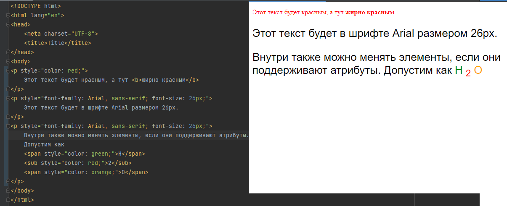
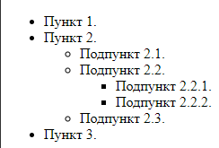

Руководство и задания к 1-ой практике

### 1. Работа с запросами к сервису погоды

Будем рассматривать 2 подхода к использованию ключа API сервиса погоды.

#### 1.1 Использование ключа в параметрах запроса

Получение ключа для API будем производить через сервис https://www.weatherapi.com/ 

Регистрируемся, если не зарегистрированы https://www.weatherapi.com/signup.aspx и подтверждаем почту

После регистрации автоматически появится версия Pro+ на 14 дней, если планируете продолжить пользоваться, то можно перейти
на бесплатную базовую версию.

Для работы будет необходим API ключ, который находится во вкладке `Dashboard`


Примеры запросов можно посмотреть в документации https://www.weatherapi.com/docs/

##### *Работа в адресной строке браузера*

Чаще всего доступ к API идёт через параметры запроса, то возвращаемую информацию можно посмотреть через браузер

Вот пример запроса к данному сервису 

`https://api.weatherapi.com/v1/current.json?key=<YOUR_API_KEY>&q=London`

здесь:
* `key` - ваш ключ доступа
* `q` - локация, где необходимо получить данные. Локацию можно задавать как именем города, так и координатами широта, 
долгота (`q=<lat>,<lon>`), как пример `q=51.52,-0.11`

##### Самостоятельно

Через браузер получите данные о погоде с использованием вашего ключа и желаемой области

Ниже приведен пример запроса для получения данных о погоде для Санкт-Петербурга

`https://api.weatherapi.com/v1/current.json?key=b4588e45fcc14bdb89d63200232109&q=59.93,30.31`


##### *Работа через команду curl*

Также можно использовать команду `curl` в консоли, чтобы получить информацию от сайта. Для корректной работы необходимо
адрес обернуть в кавычки.

```cmd
curl "https://api.weatherapi.com/v1/current.json?key=b4588e45fcc14bdb89d63200232109&q=59.93,30.31"
```


##### *Работа через модуль requests*

У Python есть сторонний модуль requests для работы с запросами. Сделаем запрос с использованием Python console PyCharm

```python
import requests

key = "b4588e45fcc14bdb89d63200232109"  # ваш ключ к API
lat = "59.93"  # широта в градусах
lon = "30.31"  # долгота в градусах

url = f"https://api.weatherapi.com/v1/current.json?key={key}&q={lat},{lon}"
response = requests.get(url)  # отправление GET запроса и получение ответа от сервера
print(response.json())  # получение JSON из ответа
```


#### 1.2 Использование ключа в заголовке запроса

В этот раз воспользуемся сервисом Яндекса

Необходимо зайти под аккаунтом яндекса и перейти в кабинет разработчика https://developer.tech.yandex.ru/, 
где подключим `API Яндекс.Погоды`


Далее заполняем форму, бесплатного тарифа в 50 запросов в день будет достаточно


Переходим в кабинет разработчика и используем предложенный ключ API


По умолчанию тариф будет стоять Тестовый. Если есть необходимость его можно понизить до «Погода на вашем сайте» у кнопки
Тарифы

Как использовать API описано в https://yandex.ru/dev/weather/doc/dg/concepts/forecast-info.html

##### *Работа в адресной строке браузера*

Обратимся к API через адресную строку

`https://api.weather.yandex.ru/v2/forecast?lat=59.93&lon=30.31`

И получим, что нет доступа, так как ключ к API необходимо передавать через заголовок, а через адресную строку это 
передать не выйдет




##### *Работа через команду curl*
 
У curl есть параметр `-H` отвечающий за формирование заголовка в запросе. У сервиса яндекс погоды есть требование как 
должен называться заголовок в котором будет передаваться ключ в общем виде это `X-Yandex-API-Key: <значение ключа>`

Пример запроса

`curl -H "X-Yandex-API-Key: 54d73608-c8dd-4c98-b18f-d9a5056525ab" "https://api.weather.yandex.ru/v2/forecast?lat=59.93&lon=30.31"`


##### *Работа через модуль requests*

Для работы с заголовками у `requests` есть параметр `headers` в который в виде словаря передаются заголовки и их значения

```python
import requests

key = "54d73608-c8dd-4c98-b18f-d9a5056525ab"  # ключ вашего API
lat = "59.93"  # широта в градусах
lon = "30.31"  # долгота в градусах

url = f"https://api.weather.yandex.ru/v2/forecast?lat={lat}&lon={lon}"
headers={"X-Yandex-API-Key": f"{key}"}

response = requests.get(url, headers=headers)
print(response.json())
```


#### 1.3 Самостоятельно 

В корне проекта создайте файл `weather_api.py`

В нем создайте функцию `current_weather` с входными переменными широты и долготы. 
Функция должна возвращать словарь(рядом с описанием написаны ключи по которым можно получить данные из возвращаемого JSON): 

* `city (город)` - ключ `['geo_object']['locality']['name']` (Яндекс), ключ `['location']['name']` (weatherapi)


* `time (время когда было обновление информации) [формат час:мин]` - ключ `['fact']['uptime']` (Яндекс возвращает время в целом 
значении секунд, для перевода к формату datetime можно воспользоваться методом `fromtimestamp` подробнее в примере), 
ключ `['current']['last_updated']` (weatherapi)


* `temp (температура [градус Цельсия])` - ключ `['fact']['temp']` (Яндекс), ключ `['current']['temp_c']` (weatherapi)


* `feels_like_temp (ощущаемая температура) [градус Цельсия]` - ключ `['fact']['feels_like']` (Яндекс), ключ `['current']['feelslike_c']` (weatherapi)


* `pressure (давление) [мм. ртутного столба]` - ключ `['fact']['pressure_mm']` (Яндекс), ключ `['current']['pressure_mb']` (weatherapi
возвращает давление в ГПа, необходимо перевести в мм. ртутного столба, для этого давление необходимо умножить на 0.75, 
результат округлить до 1 знака после запятой)


* `humidity (влажность) [%]` - ключ `['fact']['humidity']` (Яндекс), ключ `['current']['humidity']` (weatherapi)


* `wind_speed (скорость ветра) [м/с]` - ключ `['fact']['wind_speed']` (Яндекс), ключ `['current']['wind_kph']` (weatherapi возвращает 
скорость в км/ч необходимо перевести в м/с, для этого скорость нужно поделить на 3.6, 
результат округлить до 1 знака после запятой)


* `wind_gust (порывы ветра) [м/с]` - ключ `['fact']['wind_gust']` (Яндекс), ключ `['current']['gust_kph']` (weatherapi возвращает 
скорость порывов в км/ч, необходимо перевести в м/с, 
результат округлить до 1 знака после запятой)


* `wind_dir (направление ветра)` - ключ `['fact']['wind_dir']` (Яндекс возвращает латинское обозначение направления с *маленькой* буквы), 
ключ `['current']['wind_dir']` (weatherapi возвращает латинское обозначение направления с *большой* буквы)

Дополнительные данные:

Направление ветра привести к читаемому виду на русском языке, ниже таблица перевода



Для упрощения приведён словарь

```python
DIRECTION_TRANSFORM = {
    'n': 'северное',
    'nne': 'северо - северо - восточное',
    'ne': 'северо - восточное',
    'ene': 'восточно - северо - восточное',
    'e': 'восточное',
    'ese': 'восточно - юго - восточное',
    'se': 'юго - восточное',
    'sse': 'юго - юго - восточное',
    's': 'южное',
    'ssw': 'юго - юго - западное',
    'sw': 'юго - западное',
    'wsw': 'западно - юго - западное',
    'w': 'западное',
    'wnw': 'западно - северо - западное',
    'nw': 'северо - западное',
    'nnw': 'северо - северо - западное',
    'c': 'штиль',
}
```

Данные погоды взять из одного из предложенных выше API погоды. 

Входные и выходные переменные должны быть аннотированы. Должно быть описание функции.

В блоке `if __name__ == '__main__'` проверить работоспособность функции.

Кто хочет, тот может реализовать две функции на разных API, чтобы посмотреть, как отличаются данные разных сервисов.

Функция `current_weather` будет использована в следующей лабораторной работе.

Пример функции `current_weather` для API Яндекс Погода

```python
import requests
from datetime import datetime

DIRECTION_TRANSFORM = {
    'n': 'северное',
    'nne': 'северо - северо - восточное',
    'ne': 'северо - восточное',
    'ene': 'восточно - северо - восточное',
    'e': 'восточное',
    'ese': 'восточно - юго - восточное',
    'se': 'юго - восточное',
    'sse': 'юго - юго - восточное',
    's': 'южное',
    'ssw': 'юго - юго - западное',
    'sw': 'юго - западное',
    'wsw': 'западно - юго - западное',
    'w': 'западное',
    'wnw': 'западно - северо - западное',
    'nw': 'северо - западное',
    'nnw': 'северо - северо - западное',
    'c': 'штиль',
}

def current_weather(lat, lon):
    """
    Описание функции, входных и выходных переменных
    """
    token = 'Ваш токен'
    url = f"https://api.weather.yandex.ru/v2/forecast?lat={lat}&lon={lon}"
    headers = {"X-Yandex-API-Key": f"{token}"}
    response = requests.get(url, headers=headers)
    data = response.json()

    direction_transform = {
        'nw': 'северо - западное',
        'n': 'северное',
        'ne': 'северо - восточное',
        'e': 'восточное',
        'se': 'юго - восточное',
        's': 'южное',
        'sw': 'юго - западное',
        'w': 'западное',
        'c': 'штиль',
    }

    result = {
        'city': data['geo_object']['locality']['name'],
        'time': datetime.fromtimestamp(data['fact']['uptime']).strftime("%H:%M"),
        'temp': 'реализация',
        'feels_like_temp': 'реализация',
        'pressure': 'реализация',
        'humidity': 'реализация',
        'wind_speed': 'реализация',
        'wind_gust': 'реализация',
        'wind_dir': DIRECTION_TRANSFORM.get(data['fact']['wind_dir']),
    }
    return result


if __name__ == "__main__":
    print(current_weather(59.93, 30.31))
```


### 2. Создание коммитов и отправление изменений на github


### 3. Работа с HTML

