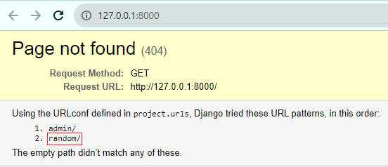
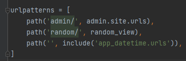
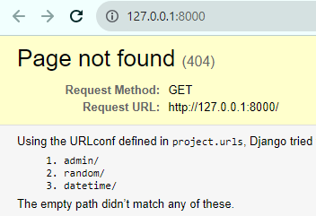
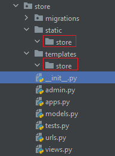
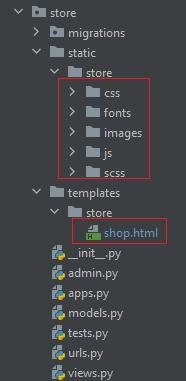
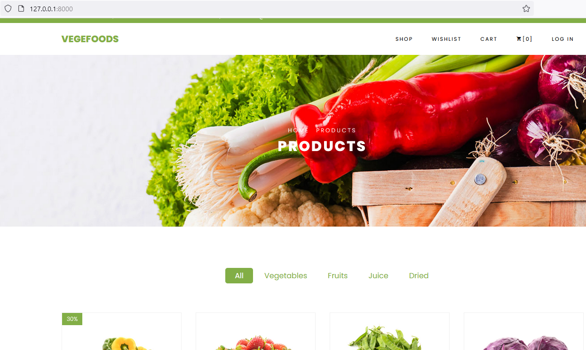

Руководство и задания к 2-ой практике

В работе будем заниматься созданием проекта "Магазин", знакомством со структурой проекта Django и
настройкой представлений 

#### 1. Создайте проект `project` (так будет называться папка в которой создастся файлы для основного управления приложением)

В консоли пропишите команду (убедиться, что находитесь в папке проекта)

`django-admin startproject project .`

`.` ставится в конце, для создания проекта внутри корневой папки, без создания новой папки для Django приложения

#### 2. Исследуйте созданные файлы проекта


#### 3. Запустите сервер приложений

`python manage.py runserver`

Если всё удачно, то зайдите на локальный хост http://127.0.0.1:8000/ , где будет развернуто ваше приложение.

Приложение выглядит совсем пустым, поэтому напишем пару представлений

#### 4. Напишем представление для получения случайного числа от сервера

Так как это достаточно простое действие, то напишем его в файле `urls.py` папки `project`

В `urls.py` обычно прописывают маршруты по которым будут обрабатываться определенные представления.

В `urls.py` к стандартному коду пропишем (можно скопировать или переписать)

```python
from random import random
from django.http import HttpResponse

def random_view(request):
    if request.method == "GET":
        data = random()
        return HttpResponse(data)
```

Функция представления обязательно должна что-то возвращать. Чаще всего она возвращает объект `HttpResponse`

Строка `request.method == "GET"` разграничивает код отображения для выполнения запроса `GET` (вспоминаем разные типы запросов)

Однако после написания данного представления чуда не произойдёт и Django приложение ничего не обработает, так как необходимо
сказать по какому маршруту будет обрабатываться данное представление. Для этого есть в `urls.py` есть переменная `urlpatterns`,
из которой Django приложение берет информацию о маршрутах обработки представлений.

Создадим маршрут для обработки представления. Первая переменная отвечает за маршрут, а вторая за обработчик который будет 
вызван в случае совпадения маршрута

`path('random/', random_view),`

Добавим маршрут к `urlpatterns`

В итоге общий код в `urls.py` будет таким


Зайдём на http://127.0.0.1:8000/ и получим следующую картинку, где видно, что есть определенные маршруты по которым 
можно перейти 



Допишем в адресную строку `/random/` и перейдем или перейдем сразу по http://127.0.0.1:8000/random/

Теперь при обновлении страницы каждый раз будет показываться новое случайное значение.


#### 5. Напишем представление для получения текущего времени от сервера

Постоянно прописывать весь код в одном файле бывает удобно, тдо тех пор пока кода будет не слишком много, поэтому в Django
есть механизм позволяющий разделить ваше приложение на определенные изолированные папки(мини-приложения).

Воспользуемся данным механизмом и создадим приложение `app_datetime` (необязательно для этого останавливать сервер(
по команде Ctrl+C в консоле, где запущен сервер), можно просто нажать на `+` в терминале и вызвать новую консоль где
прописать команду)

`python manage.py startapp app_datetime`

Теперь создалась папка с названием `app_datetime`

На данном этапе из `app_datetime` понадобится файл `views.py` в котором подразумевается нахождение представлений данного 
мини-приложения. 

По предложенному шаблону заполните функцию представление во `views.py`. Для получения текущей даты и времени можно вызвать метод `now` 
у `datetime`

```python
from django.http import HttpResponse
from datetime import datetime


def datetime_view(request):
    if request.method == "GET":
        data = ...  # Написать, что будет возвращаться из данного представления
        # Вернуть объект HttpResponse с необходимыми данными
```

Далее уже по предыдущему примеру создадим маршрут, однако, также существует практика создания маршрутов
непосредственно для нашего мини-приложения, а далее его подключим к нашему корневому `urls.py` в папке `project`

Создадим файл `urls.py` в `app_datetime` в котором запишем маршруты нашего мини-приложения

В этом файле пропишем

```python
from django.urls import path
from .views import datetime_view


urlpatterns = [
   path('datetime/', datetime_view),
]
```

Осталось только зарегистрировать этот маршрут в корневому `urls.py` в папке `project`

Для этого дозагрузим функцию `include`, а urlpatterns допишем наш путь

`path('', include('app_datetime.urls')),`



После регистрации пути выйдет ошибка, что Django не может найти приложение `app_datetime`. Приложение необходимо также 
зарегистрировать в переменной `INSTALLED_APPS` файла `settings.py` папки `project`.


Далее через основной адрес можно будет посмотреть по каким маршрутам можно перейти



По маршруту http://127.0.0.1:8000/datetime/ можно будет посмотреть текущее время

#### Самостоятельно
Ранее мы использовали маршрут `path('', include('app_datetime.urls')),` где передавали пустую первую переменную,
хотя при маршруте случайного числа передавали `'random/'`. Данное описание позволяет соединить пути из корневого `urls.py`
папки `project` с `urls.py` папки `app_datetime`.

Самостоятельно поэкспериментируйте с путями(первая переменная функции path) `path('', include('app_datetime.urls')),` 
и `path('datetime/', datetime_view)`(попробуйте первой переменной поставить пустую строку) и посмотрите как изменится 
общий путь до обработчика


#### 6. Самостоятельно напишите представление для отображения данных о погоде(используя ранее изученную API погоды)

Общие шаги будут следующие:

1. Создайте приложение `app_weather`.


2. Зарегистрируйте его в `INSTALLED_APPS`.


3. Во `views.py ` приложения создайте представление возвращающее данные о погоде. Используйте функцию `current_weather` 
написанную ранее в `weather_api.py`. Функцию импортируйте. Из параметров запроса получите данные о необходимой 
географической точке для предоставления информации о погоде.

Получить данные из запроса, можно из переменной `request` вашей функции представления. Для этого обратитесь к переменной
`GET` объекта `request`, в котором будет `словарь`, где ключи словаря - переменные в запросе, значения - значения 
переменных в запросе.

Например

```python
from django.http import JsonResponse

def my_view(request):
    if request.method == "GET":
        print(request.GET)  # словарь с параметрами запроса. 
        # Допустим при обработке запроса https://example.ru?q=запрос&a=ответ данный обработчик выдаст следующий словарь
        # {'q': 'запрос', 'a': 'ответ'}
        data = {...}  # Результат работы функции current_weather
        # А возвращаем объект JSON. Параметр json_dumps_params используется, чтобы передать ensure_ascii=False
        # как помните это необходимо для корректного отображения кириллицы
        return JsonResponse(data, json_dumps_params={'ensure_ascii': False})
```

4. Создайте `urls.py` в `app_weather` и пропишите маршрут к представлению. 


5. Зарегистрируйте данный маршрут в корневом `urls.py`.


6. Проверьте работоспособность вашего приложения как ручным методом (перейти по адресу в браузере как пример 
`http://127.0.0.1:8000/weather/?lat=59.93&lon=30.31`), так и с помощью модуля `requests` (как на первой практике).


#### 7. Работа с данными магазина

Далее сделаем возможность подключения к базе товаров нашего магазина. База оформлена в виде словаря.

1. Создадим новое приложение `store`
2. Зарегистрируйте его в `INSTALLED_APPS`.
3. В файле `models.py` приложения `store` сформируем базу товаров (скопируем из кода ниже и вставим в `models.py`)

```python
DATABASE = {'1': {'name': 'Bell Pepper',
                  'discount': 30,
                  'price_before': 120.00,
                  'price_after': 80.00,
                  'id': 1,
                  'url': 'store/images/product-1.jpg'},
            '2': {'name': 'Strawberry',
                  'discount': None,
                  'price_before': 120.00,
                  'id': 2,
                  'url': 'store/images/product-2.jpg'},
            '3': {'name': 'Green Beans',
                  'discount': None,
                  'price_before': 120.00,
                  'id': 3,
                  'url': 'store/images/product-3.jpg'},
            '4': {'name': 'Purple Cabbage',
                  'discount': None,
                  'price_before': 120.00,
                  'id': 4,
                  'url': 'store/images/product-4.jpg'},
            '5': {'name': 'Tomatoe',
                  'discount': 30,
                  'price_before': 120.00,
                  'price_after': 80.00,
                  'id': 5,
                  'url': 'store/images/product-5.jpg'},
            '6': {'name': 'Brocolli',
                  'discount': None,
                  'price_before': 120.00,
                  'id': 6,
                  'url': 'store/images/product-6.jpg'},
            '7': {'name': 'Carrots',
                  'discount': None,
                  'price_before': 120.00,
                  'id': 7,
                  'url': 'store/images/product-7.jpg'},
            '8': {'name': 'Fruit Juice',
                  'discount': None,
                  'price_before': 120.00,
                  'id': 8,
                  'url': 'store/images/product-8.jpg'},
            '9': {'name': 'Onion',
                  'discount': 30,
                  'price_before': 120.00,
                  'price_after': 80.00,
                  'id': 9,
                  'url': 'store/images/product-9.jpg'},
            '10': {'name': 'Apple',
                   'discount': None,
                   'price_before': 120.00,
                   'id': 10,
                   'url': 'store/images/product-10.jpg'},
            '11': {'name': 'Garlic',
                   'discount': None,
                   'price_before': 120.00,
                   'id': 11,
                   'url': 'store/images/product-11.jpg'},
            '12': {'name': 'Chilli',
                   'discount': None,
                   'price_before': 120.00,
                   'id': 12,
                   'url': 'store/images/product-12.jpg'},
            }
```

3. Во `views.py` создадим представление возвращающее объект JSON из базы данных по переданному ключу словаря,
если такого ключа нет, то возвращаем ошибку. Если ключ не был передан, то возвращаем всю базу данных.


```python
from django.http import JsonResponse, HttpResponseNotFound
from .models import DATABASE


def products_view(request):
    if request.method == "GET":
        if id_product := request.GET.get("id"):
            if data := DATABASE.get(id_product):
                return JsonResponse(data)
            return HttpResponseNotFound("Данного продукта нет в базе данных")

        return JsonResponse(DATABASE)
```

4. Создаём `urls.py`, регистрируем путь для обработчика (не забываем про корневой `urls.py`)
5. Проверяем работоспособность (возвращает ошибку, возвращает продукт, возвращает все продукты)


#### 8. Рендер HTML файлов

Последнее, что осталось сделать, это подключить вывод HTML файлов

1. Создадим папку `static` и `templates` в приложении `store`. В папках `static` и 
`templates` создадим папку `store`. 

Выглядеть это будет так



Далее в папку `store/static/store` скопируем папки из `files/lab2/static`, а в папку
`store/templates/store` скопируем `shop.html` из `files/lab2`. В итоге должно получиться
следующее



Специфика дублирования названия `store` у `static` и `templates` вызвана поиском
статических файлов и шаблонов механизмом Django. 

Django производит поиск статических 
файлов и шаблонов в приложениях указанных в `INSTALLED_APPS` в `settings.py` и только
в зарезервированных именах папок (`static`, `templates`) поэтому добавляется ещё одна
папка с именем приложения, для разграничения возможных одинаковых файлов по названию
и исключения некорректного обращения к файлам с одинаковым названием. Данные примеры
иллюстрирующие возможные особенности будут приведены в следующих лабораторных работах.

2. Создадим представление, которое будет возвращать HTML шаблон.

Возвращением HTML шаблона с подставлением данных в шаблон занимается метод `render`
из `django.shortcuts` 

Во `views.py` приложения `store` пропишем

```python
from django.shortcuts import render

def shop_view(request):
    if request.method == "GET":
        return render(request, 'store/shop.html')
```

В функцию `render` передаётся объект запроса `request` и путь до шаблона 
(обратите внимание путь идёт после папки `templates` вне зависимости от того в 
каком приложении находится, поэтому и дополнительно создавалась папка `store` в 
`templates`)

3. В `urls.py` приложения `store` пропишите маршрут к представлению. Чтобы 
рассматриваемый HTML файл подгружался сразу при входе на сайт, то можно прописать
путь с пустой строкой, такой как

`path('', shop_view),`

Так как приложение `store` уже было зарегистрировано в `INSTALLED_APPS`, то
шаблон должен корректно отобразиться на заходе на сайт. В самом шаблоне уже 
прописаны некоторые моменты облегчающие его правильное отображение(про настройку
тегов будет рассказано в следующих практиках).

4. Проверьте, что всё отрабатывает корректно при входе на главную страницу сайта.

Страница должна выглядеть так



Функционал, что был сделан ранее никак не затронут, предыдущие маршруты работают.

### Практика закончена.