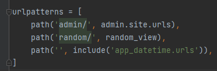

Руководство и задания к 3-ей практике

Создадим файл `urls.py` в `app_datetime` в котором запишем маршруты нашего мини-приложения

В этом файле пропишем

```python
from django.urls import path
from .views import datetime_view


urlpatterns = [
   path('datetime/', datetime_view),
]
```

Осталось только зарегистрировать этот маршрут в корневому `urls.py` в папке `project`

Для этого дозагрузим функцию `include`, а urlpatterns допишем наш путь

`path('', include('app_datetime.urls')),`




#### Самостоятельно
Ранее мы использовали маршрут `path('', include('app_datetime.urls')),` где передавали пустую первую переменную,
хотя при маршруте случайного числа передавали `'random/'`. Данное описание позволяет соединить пути из корневого `urls.py`
папки `project` с `urls.py` папки `app_datetime`.

Самостоятельно поэкспериментируйте с путями(первая переменная функции path) `path('', include('app_datetime.urls')),` 
и `path('datetime/', datetime_view)`(попробуйте первой переменной поставить пустую строку) и посмотрите как изменится 
общий путь до обработчика


Получить данные из запроса, можно из переменной `request` вашей функции представления. Для этого обратитесь к переменной
`GET` объекта `request`, в котором будет `словарь`, где ключи словаря - переменные в запросе, значения - значения 
переменных в запросе.

Например

```python
from django.http import JsonResponse

def my_view(request):
    if request.method == "GET":
        print(request.GET)  # словарь с параметрами запроса. 
        # Допустим при обработке запроса https://example.ru?q=запрос&a=ответ данный обработчик выдаст следующий словарь
        # {'q': 'запрос', 'a': 'ответ'}
        data = {...}  # Результат работы функции current_weather
        # А возвращаем объект JSON. Параметр json_dumps_params используется, чтобы передать ensure_ascii=False
        # как помните это необходимо для корректного отображения кириллицы
        return JsonResponse(data, json_dumps_params={'ensure_ascii': False})
```


Во `views.py` создадим представление возвращающее объект JSON из базы данных по переданному ключу словаря,
если такого ключа нет, то возвращаем ошибку. Если ключ не был передан, то возвращаем всю базу данных.


```python
from django.http import JsonResponse, HttpResponseNotFound
from .models import DATABASE


def products_view(request):
    if request.method == "GET":
        if id_product := request.GET.get("id"):
            if data := DATABASE.get(id_product):
                return JsonResponse(data)
            return HttpResponseNotFound("Данного продукта нет в базе данных")

        return JsonResponse(DATABASE)