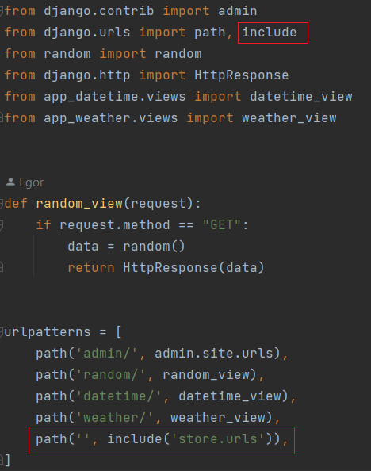
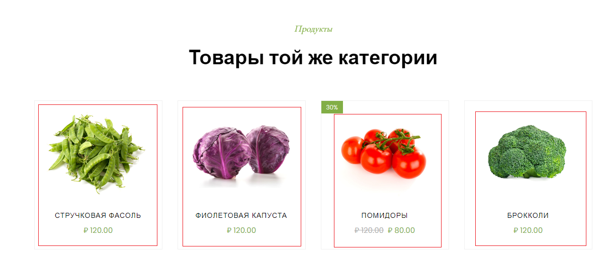

Руководство и задания к 3-ей практике

### 1. Работа с вложенными маршрутами

Ранее мы писали все маршруты в корневом файле `urls.py`, что может быть достаточно неудобно, особенно когда маршрутов будет много приложений, когда 
каждое приложение внутри себя обрабатывает несколько маршрутов. Пример приложение `store` от него в `urls.py` уже используется
2 маршрута (`'product/'` и `''`).

На практике можно в корневом `urls.py` прописывать только файл с маршрутами приложения, а Django уже сам подтянет
маршруты из приложения, так структура становится более читаемая.

Для этого создадим файл `urls.py` в приложении `store`, где пропишем маршруты скопированные из корневого `urls.py` (в папке `project`).
Маршруты располагаются во всё той же переменной `urlpatterns` - это зарезервированная переменная в Django, в которой предполагается 
хранение маршрутов обработки представлений. 

```python
# urls.py in store

from django.urls import path
from .views import products_view, shop_view

urlpatterns = [
    path('product/', products_view),
    path('', shop_view),
]
```

Далее в корневом `urls.py` необходимо поправить прошлые маршруты, для это воспользуемся функцией `include`
позволяющая указать приложение, а Django самостоятельно возьмёт маршруты из переменной `urlpatterns` приложения.

Вот как трансформируются маршруты приложения `store` в корневом `urls.py`

```python
path('', include('store.urls')),
```
А корневой `urls.py` будет выглядеть так



Теперь ссылки, что были доступны ранее для приложения `store` также доступны.

#### Самостоятельно

Самостоятельно перепишите маршрут с использованием `include` для приложения `app_weather`,
но сделайте так, чтобы тот маршрут, по которому ранее обрабатывался прогноз погоды - также обрабатывался.

Допустим если до использования `include` - прогноз погоды был доступен по адресу http://127.0.0.1:8000/weather/ ,
то после использования `include` - адрес доступа сохранился.


### 2. Работа с параметрами запроса

Ранее в приложении прогноза погоды, мы не могли изменить координату через адресную строку,
приходилось менять это значение в коде, теперь давайте сделаем код более гибким и будем брать
значения координат для прогноза погоды из прааметров GET запроса.

Получить данные из запроса, можно из переменной `request` вашей функции представления. Для этого обратитесь к переменной
`GET` объекта `request` (`request.GET`), в котором будет `словарь`, где ключи словаря - переменные в запросе, значения - значения 
переменных в запросе.

Допустим при обработке запроса `https://example.ru?q=запрос&a=ответ` из `request.GET` 
получим словарь `{'q': 'запрос', 'a': 'ответ'}`, который можно использовать для своих нужд.

Тогда код представления для прогноза погоды будет следующим.

```python
from django.http import JsonResponse
from weather_api import current_weather


def weather_view(request):
    if request.method == "GET":
        lat = request.GET.get('lat')  # данные придут в виде строки
        lon = request.GET.get('lon')  # данные придут в виде строки
        if lat and lon:
            data = current_weather(lat=lat, lon=lon)
        else:
            data = current_weather(59.93, 30.31)
        return JsonResponse(data, json_dumps_params={'ensure_ascii': False,
                                                     'indent': 4})
```

И теперь к сервер берет данные из строки запроса и работает с ними. Допустим так
можем узнать погоду в Москве http://127.0.0.1:8000/weather?lat=55.75&lon=37.61 

А если ничего не передать, то погоду будет в Санкт-Петербурге http://127.0.0.1:8000/weather .

#### Самостоятельно

Доработайте представление `products_view` приложения `store` так, чтобы через параметры запроса `id` 
представление реализовывало следующий функционал:
* Если `id` было передано в запросе и такой ключ существует в `DATABASE`, то представление возвращает характеристики товара
* Если `id` было передано в запросе и такого ключа НЕ существует в `DATABASE`, то представление возвращает 
`HttpResponseNotFound("Данного продукта нет в базе данных")`
* Если `id` НЕ было передано в запросе, то возвращает все товары.

Пример файла `view.py` приложения `store` 

```python
from django.http import JsonResponse, HttpResponse, HttpResponseNotFound
from .models import DATABASE


def products_view(request):
    if request.method == "GET":
        # Ваша реализация
```

Проверьте, что ваше представление отрабатывает все случаи:

* 'Нет продукта' - http://127.0.0.1:8000/product/?id=0

* 'Один продукт' - http://127.0.0.1:8000/product/?id=3

* 'Все продукты' - http://127.0.0.1:8000/product/

### 3. Работа с параметрами запроса через обработчик маршрутов Django

Скопируем папку `products` из папки `files/lab3` в папку `store`. В папке приведены HTML страницы товаров
разрабатываемого магазина. Можете открыть данные файлы в превью ли браузере и ознакомиться с данным файлом.
Если пролистать вниз в этом файле, то в разделе товары той же категории можете нажать на товары и перейти на соответствующие продукты.



Сделаем возможность отобразить наши товары с использованием Django и в более информативном виде, чем JSON объект. 
Будем возвращать HTML файлы (как в прошлой работе).

Для этого во `views.py` приложения `store` создадим новое представление `products_page_view` (так как представление 
`products_view` у нас возвращает объект JSON)

*Передача параметров с типом `slug`*

В `products_page_view` передадим параметр `page`, он будет идентификатором страницы, по этому идентификатору мы будем понимать,
что за страница нужна для отображения. Сейчас примем тот факт, что переменная `page` будет строкового типа с именем `html`
страницы которую будем отображать.

Заполните шаблон представления

```python
def products_page_view(request, page):
    if request.method == "GET":
        for data in DATABASE.values():
            if data['html'] == page:  # Если значение переданного параметра совпадает именем html файла
                # 1. Откройте файл open(f'store/products/{page}.html', encoding="utf-8") (Не забываем про контекстный менеджер with)
                # 2. Прочитайте его содержимое
                # 3. Верните HttpResponse c содержимым html файла
        
        # Если за всё время поиска не было совпадений, то значит по данному имени нет соответствующей 
        # страницы товара и можно вернуть ответ с ошибкой HttpResponse(status=404)
        return HttpResponse(status=404)
```

Теперь настроим обработку маршрутов

В `urls.py` приложения `store` пропишем маршрут с параметром `<``slug:page``>`

```python
path('product/<slug:page>.html', products_page_view),
```

Можно заметить, что у нас уже есть маршрут `product/` по которому возвращается JSON с нашими товарами. Так как маршруты
у нас разные и конфликтовать не будут, так как в первом случае ожидается путь вида `product/`, а во втором
путь вида `product/samyj-luchshij-tovar.html`

.html в параметре стоит просто для вида, она добавляется к запросу как часть пути, допустим

`http://127.0.0.1:8000/product/onion.html` - в данном конкретном случае Django разложит адрес на составляющие и передаст
`onion` в `products_page_view` как переменную `page`. Как в данном случае `products_page_view(..., page='onion')` ну, а далее
в зависимости найдёт он в базе данных совпадение или нет, то представление вернёт соответствующий результат.

Проверим работоспособность на примере http://127.0.0.1:8000/product/onion.html 

В нашем случае это будет страница товара "Лук"


Из реальных примеров типа `slug` может быть большинство интернет площадок с товарами, допустим на примере Ozon.
По данной ссылке откроется книга по Python, но нам важен не результат, что ссылка открылась, как сама ссылка

https://www.ozon.ru/product/chistyy-python-tonkosti-programmirovaniya-dlya-profi-beyder-den-211426197

Мы видим, что после  `www.ozon.ru/` далее идёт `product/`, а за ним идёт уже полезная нагрузка в виде названия и артикула(возможно).
И на примере путей Django можно было бы создать такой обработчик `'product/``<``slug:page``>``-``<``int:articul``>``'`. 
Который бы разбил адресную строку как бы нам было нужно.


*Передача параметров с типом `int`*

В нашем случае магазин маленький и можно облегчить задачу и передавать не только по имени товара, но и по его `id` в базе данных.

Здесь нам поможет параметр `int`. Создадим маршрут

```python
path('product/<int:page>', products_page_view),
```

Вы не ошиблись, мы создали 2 различных маршрута (один с `slug` другой с `int`) и привязали к одному представлению. Данный
подход имеет место на практике, но тогда необходимо переписать наше представление, чтобы оно могло обрабатывать
и тип `slug` и тип `int` который может прийти в переменной `page` функции `products_page_view`

Допишем данную функцию:

```python
def products_page_view(request, page):
    if request.method == "GET":
        if isinstance(page, str):
            # То, что было ранее для обработки типа slug
        elif isinstance(page, int):
            data = DATABASE.get(str(page))  # Получаем какой странице соответствует данный id
            if data:
                # 1. Откройте файл open(f'store/products/{data["html"]}.html', encoding="utf-8") (Не забываем про контекстный менеджер with)
                # 2. Прочитайте его содержимое
                # 3. Верните HttpResponse c содержимым html файла

        return HttpResponse(status=404)
```

Теперь можно обратиться по адресу http://127.0.0.1:8000/product/9 , который вернет товар "Лук"


logic/services - чистый python фильтрует продукты из models

вызвать фильтрацию во view

add in cart
