Руководство и задания к 4-ой практике.

### 1. Знакомство с функцией render

Ранее создавали базу данных `DATABASE` в `models.py` приложения `store` и использовали её для получения JSON объекта
при подключении к пути http://127.0.0.1:8000/product , но у нас также есть путь 
http://127.0.0.1:8000/ который возвращает нашу стартовую страницу магазина, где участвуют наши товары.

Давайте используем нашу базу для того, чтобы заполнить данные в HTML файле `shop.html`, но
не вручную, а при помощи тегов шаблонизатора Django.

Для того чтобы Django указать, что необходимо использовать шаблонизатор для обработки HTML файла
существует функция `render` со своими входными параметрами.

Давайте изменим функцию представление `shop_view`, чтобы переписать его с использованием
`render`

```python
from django.shortcuts import render

def shop_view(request):
    if request.method == "GET":
        return render(request, 'shop.html')
```
Зайдём по ссылке http://127.0.0.1:8000/ и получим ошибку, что шаблон не найден

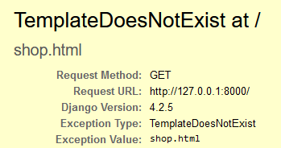

Данная ошибка вызвана тем, что Django будет искать данный файл во всех приложениях
описанных в словаре `INSTALLED_APPS` файла `settings.py`, а искать html файл он будет 
в папке `templates` в приложении.

Поэтому создадим папку `templates` в приложении `store` и перенесём туда наш `shop.html`

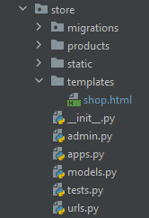

Теперь снова попробуем зайти на главную страницу (может так случиться, что ничего не изменилось, тогда 
остановите сервер сочетанием клавиш Ctrl+C в консоле. Заново запустите сервер и зайдите
на главную страницу)

При помощи render мы ушли от необходимости считывания файла и отправки `HttpResponse`, как делали ранее,
но теперь файлы html считываются только из отдельной папки `templates`.

У Django есть ещё одна особенность при работе с шаблонами. Ранее я говорил, что файл шаблонизатор ищет среди
тех приложений, которые указаны в словаре `INSTALLED_APPS` файла `settings.py`. Причём поиск идёт последовательно, сверху вниз.
Поэтому если в папках templates двух приложений будет одинаковый по названию файл, то
шаблонизатор выберет файл из того приложения, что ему попадётся первым из `INSTALLED_APPS`.

Проведём небольшой эксперимент. Создадим папку `templates` в приложении `app_datetime`.
В данной папке `templates` создадим пустой файл `shop.html`.

Перезагрузите сервер и посмотрите что будет если вы зайдёте на стартовую страницу. 
Теперь привычная картинка стала пустая. Как и было сказано ранее это произошло из-за специфики поиска
документов в Django.

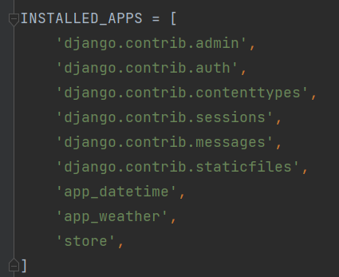

Существует подход активно используемый на практике, для обхода данных особенностей, этот подход заключается
в создании ещё одной папки с названием приложения в `templates` и переноса html файлов в данную папку, таким образом
даже если у двух приложений будут одинаковые названия файлов, то в `templates` они будут располагаться в своих
папках с приложениями и всё будет отображаться верно.

Вот как в итоге будет выглядеть путь `shop.html` в приложении `store`

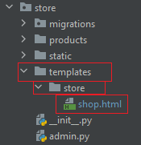

Но, мы сменили путь к `shop.html`, а значит должны указать правильный маршрут в функции `render` нашего представления
`shop_view`

```python
def shop_view(request):
    if request.method == "GET":
        return render(request, 'store/shop.html')
```

Заходим на главную страницу и видим, что всё снова отображается верно.

### 2. Знакомство с тегом static

Представим такую ситуацию - нам срочно нужно переехать на новый сервер, но все 
статические файлы (картинки, скрипты javascript, css файлы) мы хотим перенести на отдельный сервер, чтобы
в случае чего данные проще было использовать, если что-то выйдет из строя. Но вот незадача, 
чтобы это сделать во всех наших html файлах нужно будет вручную поменять все ссылки на новый сервер, иначе
картинки на сайте просто не откроются.

Для того чтобы минимизировать ручные изменения ссылок в будущем, мы в текущем используем тег `static` который
считает шаблонизатор Django и при формировании html станицы в виде ответа - самостоятельно подставит нужный
начальный путь, где лежат картинки.

Но у данного подхода аналогичные особенности, как и у поиска html файлов:

1. Должна быть специальная папка `static` в приложении
2. Если вдруг в двух разных приложениях в папке `static` будут одинаковые файлы, то как и в случае с `templates`
файл загрузится из того приложения что будет выше в `INSTALLED_APPS`. Поэтому тут как и с `templates` продублируем
название приложения в виде папки в `static`

В итоге наше приложение `store` теперь выглядит так:

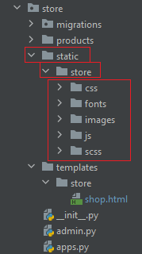

Поправим наш html файл `store.html` так как путь до статических файлов изменился.

Используем для этого тег ``

Для начала загрузим эту возможность в наш html файл, для этого вверху файла пропишем ``

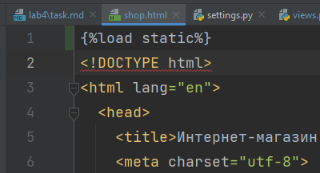

Затем все ссылки на статические файлы необходимо заменить с использованием тега `static`

Например ссылка (13 строка `shop.html`):

```html
href="static/css/open-iconic-bootstrap.min.css"
```
Трансформируется в (не забываем, что теперь наши статические файлы находятся в дополнительной папке `store`)

```html
href=""
```

А данная ссылка на 74 строке `shop.html`

```html
style="background-image: url(static/images/bg_1.jpg);
```
Трансформируется в 

```html
style="background-image: url();
```

И так необходимо сделать со всеми статическими файлами(картинки, css, js) в `shop.html`

Для облегчения работы можно воспользоваться поиском с заменой в файле. В файле 
`shop.html` нажмите комбинацию клавиш `Ctrl+R`, где появятся 2 поля:

* верхнее поле ищет текст, что написан;
* нижнее поле заменяет на текст, что написан;

Найдем `static/` и заменим на `{% static 'store/` (настоятельно рекомендую нажать Replace и
пройтись по каждой предложенной строчке, чтобы увидеть где-же в данном html находятся статические файлы)

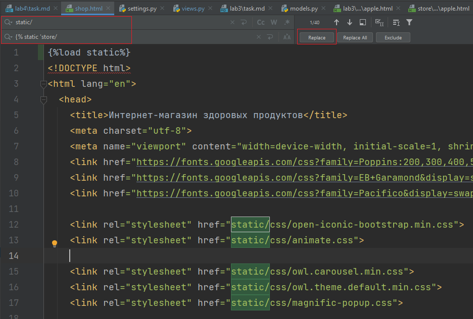

Но одного открытого тега `"`  |
| `jpg`  | `jpg' %}`   |
| `png`  | `png' %}`   |
| `js"`  | `js' %}"`   |

Перезагрузите сервер и проверьте всё ли корректно работает

Если всё выполнено верно, то главная страница должна корректно отображаться.

Также корректность загрузки всех статических элементом можно проверить в консоли. Все файлы
будут с кодом 200, а не код 404.

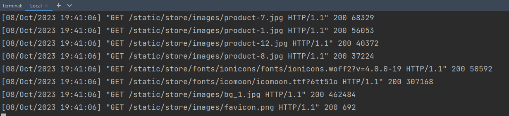

### 3. Работа с параметрами передаваемыми в шаблон

Далее передадим данные о товарах в файл `shop.html` (для того, чтобы иметь возможность
при изменении товаров в DATABASE - товары автоматически менялись в магазине)

Для этого через параметр `context` функции `render` можно передать словарь, значения которого
будут использоваться для подставления значений в html файл.

В нашем случае в `shop_view` в `render` пропишем следующее

```python
return render(request, 
              'store/shop.html', 
              context={"products": DATABASE.values()})
```

В `context` передаём словарь с ключом `products` и всеми продуктами, что есть в базе данных

#### 3.1 Работа с тегом 

В `shop.html` найдём блок

```html
<div class="col-md-6 col-lg-3 ftco-animate">
```

Их всего 12 штук, ровно столько сколько есть товаров. В данном блоке содержится информация
о товаре.

До открытия этого блока поставьте тег открытия цикла 

``

а после закрытия блока продукта поставьте тег закрытия цикла

``

Или можете свернуть блок 

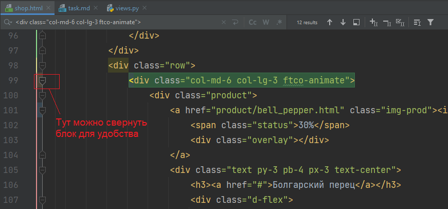

и до и после блока поставить теги

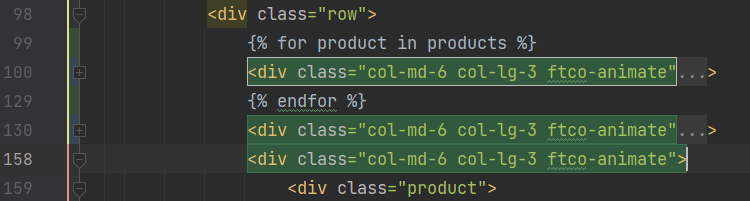

Конструкция `for product in products` выглядит довольно знакомо для Python, но
что такое `products`? `products` это равно тот ключ, что мы передавали в `context`.
Вот что передавали `context={"products": DATABASE.values()}` соответственно в `products`
у нас итерируемый объект со всеми продуктами.

Если зайти на главную страницу, то увидим множество клонов Болгарского перца, ровно 12
штук, именно столько товаров в `DATABASE.values()`.

Но хотелось бы иметь те товары, что есть в базе данных, а не 12 клонов одного товара.

Теперь мы подошли к понятию использования переменных шаблона. В шаблонизаторе обращение 
к объекту переменной идёт через `.`, когда в python по `[]`, поэтому, для обращения будем 
использовать:

| Описание          | Значение         | На что заменить            |
|-------------------|------------------|----------------------------|
| Скидка            | 30               | `{{product.discount}}`     |
| Название продукта | Болгарский перец | `{{product.name}}`         |
| Регулярная цена   | 300              | `{{product.price_before}}` |
| Цена со скидкой   | 210              | `{{product.price_after}}`  |

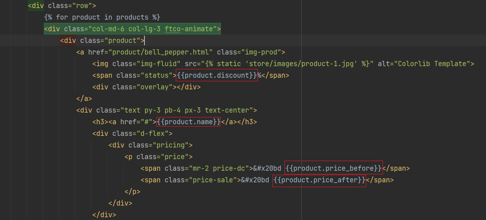

Если обратиться к главной странице, то увидим, что теперь описания и цены поменялись,
но неправильное отображение картинки товара и скидки

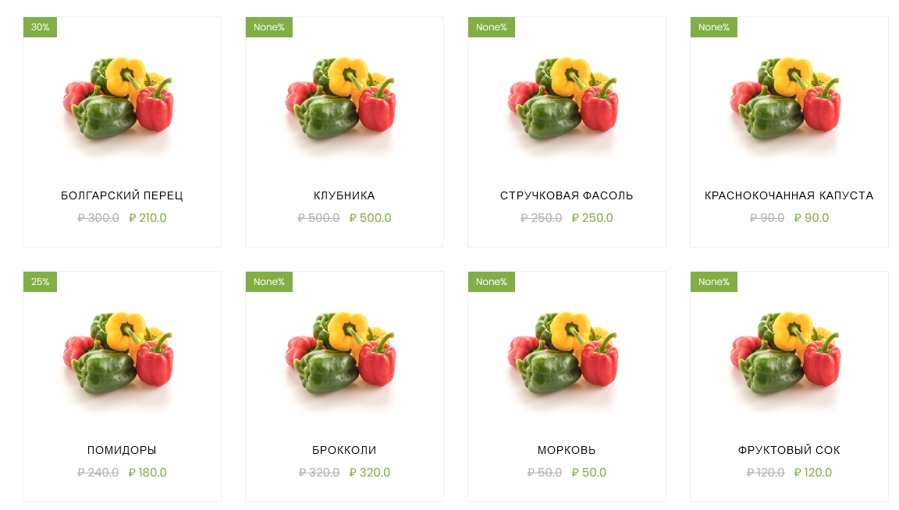

Поправим сначала картинку.

В данном примере работа с картинкой выбивается от общего паттерна, так как данная картинка уже в теге
``

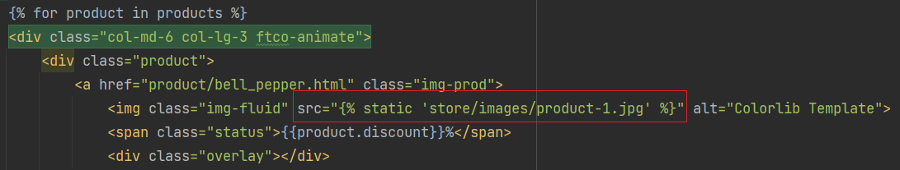

а раз картинка в теге, то можно передать её значение без дополнительных скобок(если значение не в теге, 
то передаём как делали ранее через `{{}}`)

| Описание              | Значение                   | На что заменить        |
|-----------------------|----------------------------|------------------------|
| Расположение картинки | store/images/product-1.jpg | `product.url`          |

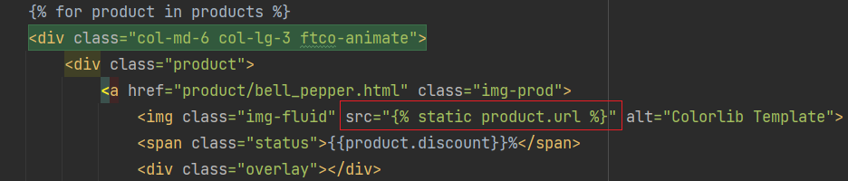

Вопрос с одинаковыми картинками решен, но со скидкой вопрос остался

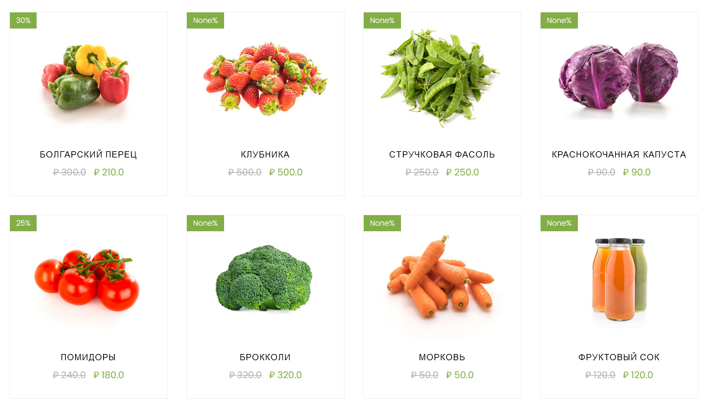

#### 3.2 Работа с условиям - тег 


Чтобы решить вопрос со скидкой нужно понять как поставить условие, так как если 
`{{product.discount}}` не None, то скидка есть, иначе отображается только одна цена, 
зеленая плашка слева вверху картинки не отображается. У языка шаблонов есть для этого
блок тегов `......`, который мы и используем.

Решим вопрос с зеленой плашкой и поставим блок тегов как на картинке(нового html кода нет, только размещены теги)

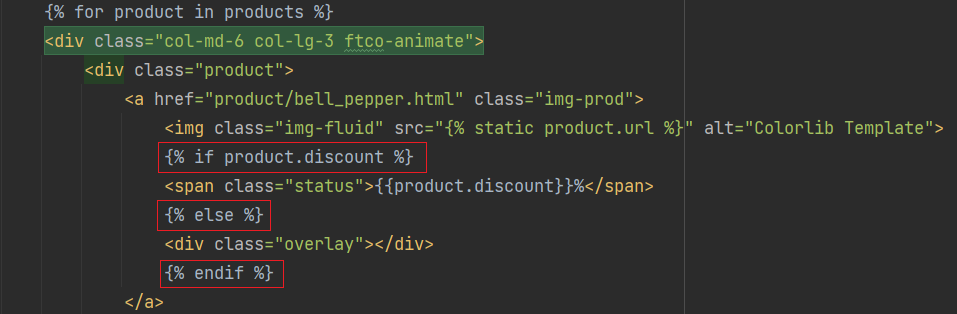

А с зачеркивающимися ценами поступим так, если скидка есть, то оставляем что есть, а если скидки нет,
то просто пишем регулярную цену `<span>&#x20bd {{product.price_before}}</span>`

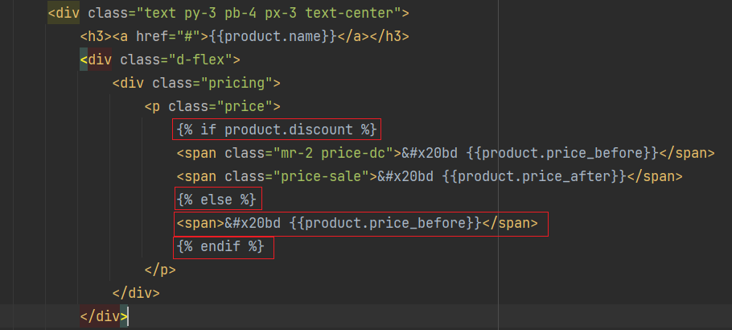

Теперь всё отображается корректно, то товаров больше чем нужно, так как остальные 11
товаров после цикла отображаются. Удалим их. Для этого можете свернуть все блоки 
```html
<div class="col-md-6 col-lg-3 ftco-animate">
```
А затем удалить блоки после закрытого тега цикла.

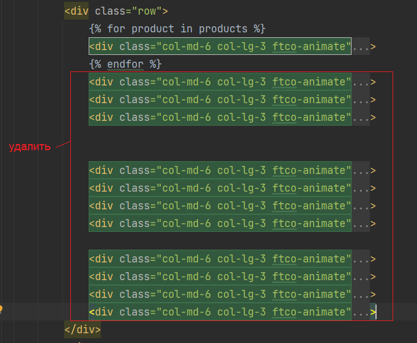

После удаления

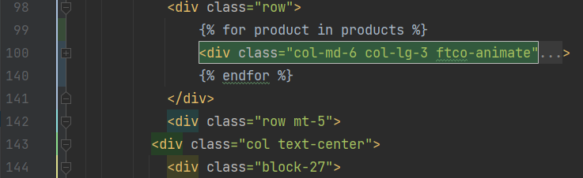

В итоге после удаление лишнего главная страница вернётся к правильному отображению. 
При этом мы храним меньше html кода.

#### 3.3 Работа с тегом 

Но вот незадача, при переходе по картинке товара, мы всё время переходим на Болгарский перец, вместо нужного товара (не обращаем внимания, что нет картинок при переходе,
это вызвано с изменением папки со статическими файлами, чтобы были ранее).

Данный переход связан с тем, что в цикле ссылаемся на постоянное значение ссылки

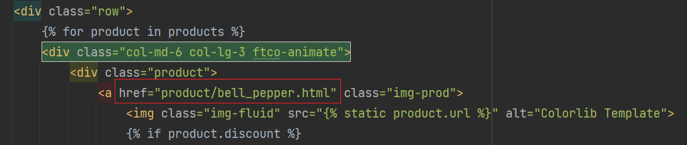

Для решения данной проблемы можно пойти несколькими путями: 

1. Ручное прописывание пути с параметром. В базе данных в ключе `html` лежит нужное значение

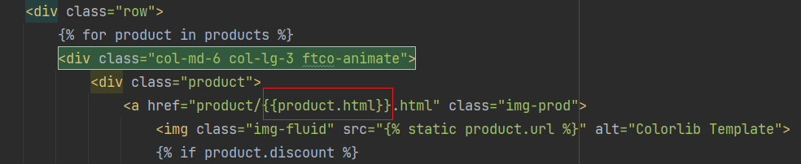

Данный подход череват тем, что если вы решите изменить маршрут по которому будет обрабатываться
информация о продукте, то придётся в html вручную исправлять ссылку.

2. Использование тега  возвращающего маршрут обработчика по имени обработчика

`href=""`

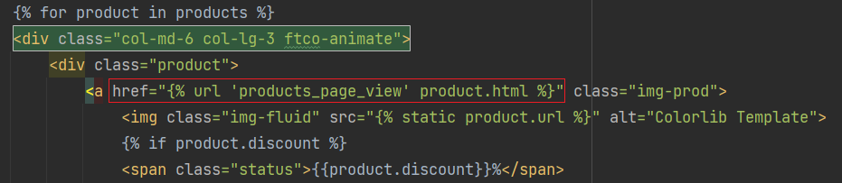

Но в таком подходе придётся именовать обработчики, что их затем можно было использовать для получения пути.

Для это в `urls.py` приложения `store` пропишем имя обработчика маршрутов через параметр `name`

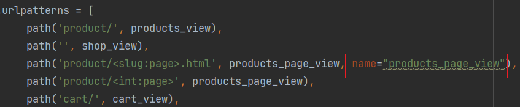

Имя обработчику можно дать любое, главное чтобы было понятное.

Данный подход уже не завязан на ручном изменении, и изменение маршрута до обработчика 
не повлияет на результат перехода.

Однако существует вероятность, что вы назовете обработчики одинаково в двух разных приложениях (вспомните особенности папки 
static и templates), поэтому в данном случае можно разделить пространства имён обработчиков приложений.

Для этого в `urls.py` приложения `store` создадим переменную `app_name` и присвоим ей значение `'store'`

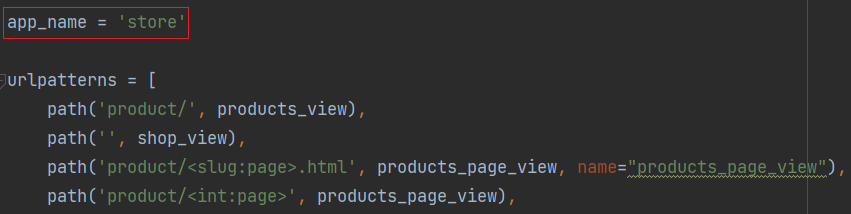

А уже в `shop.html` в теге `{}` пропишем пространство приложения 
``

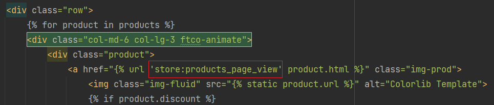

Таким образом вы можете назвать обработчики одинаково в двух приложениях и быть уверенными, 
что они будут обрабатывать верно.

### 4. Применение фильтрации на главной странице

Ранее мы с вами делали функции способные фильтровать наши товары, вы даже сделали
представление возвращающее JSON с фильтрующими параметрами.

Теперь давайте применим это.

Скопируем код, что был ранее для фильтрации из параметров запроса представления
`products_view` и используем это для фильтрации товаров на главной странице.

Ниже приведен полный код `shop_view` с возможностью фильтрации

```python
def shop_view(request):
    if request.method == "GET":
        # Обработка фильтрации из параметров запроса
        category_key = request.GET.get("category")
        if ordering_key := request.GET.get("ordering"):
            if request.GET.get("reverse") in ('true', 'True'):
                data = filtering_category(DATABASE, category_key, ordering_key,
                                          True)
            else:
                data = filtering_category(DATABASE, category_key, ordering_key)
        else:
            data = filtering_category(DATABASE, category_key)
        return render(request, 'store/shop.html',
                      context={"products": data})
```

Теперь через адресную строку можно фильтровать. 


#### 4.1 Фильтрация по нажатию на кнопки (по желанию)

Сделаем фильтрацию по нажатию кнопки 

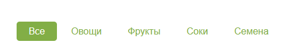

Для этого в `urls.py` назовем обработчик

```python
path('', shop_view, name="shop_view")
```
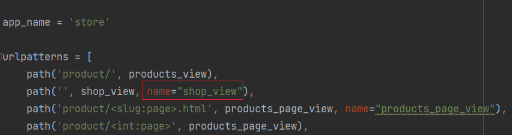

Затем в представлении `shop_view` в словарь передадим какую категорию выбрали для фильтрации

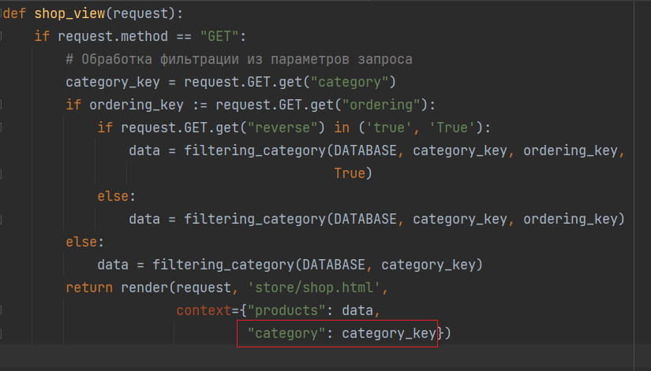

И наконец в `shop.html` найдём `<ul class="product-category">`

И данные элементы списка 

```html
<li><a href="#" class="active">Все</a></li>
<li><a href="#">Овощи</a></li>
<li><a href="#">Фрукты</a></li>
<li><a href="#">Соки</a></li>
<li><a href="#">Семена</a></li>
```

Превратим в 

```html

<li><a href="" class="active">Все</a></li>

<li><a href="">Все</a></li>



<li><a href="?category={{category}}" class="active">Овощи</a></li>

<li><a href="?category=Овощи">Овощи</a></li>



<li><a href="?category={{category}}" class="active">Фрукты</a></li>

<li><a href="?category=Фрукты">Фрукты</a></li>



<li><a href="?category={{category}}" class="active">Соки</a></li>

<li><a href="?category=Соки">Соки</a></li>



<li><a href="?category={{category}}" class="active">Семена</a></li>

<li><a href="?category=Семена">Семена</a></li>

```

Здесь мы проверяем какая категория есть в параметрах переданных в шаблон, и затем
данную категорию делаем активной (появляется зелёная обводка)

Теперь при нажатии на ссылку категории происходит фильтрация

### Создание и использование общих шаблонов для файлов


### Работа с корзиной

