Руководство и задания к 5-ой практике. На практике поработаем с шаблонами и языком шаблонов. Потренируемся
разделять и наследовать шаблоны.

Ранее мы с вами постоянно обращались к адресной строке, чтобы перейти на тот или иной функционал. Но это неудобно когда
переходим часто. Пропишем в нашей навигационной панели переходы, чтобы можно было перемещаться через навигационную панель.

Для этого в `base.html` пропишем ссылки для переходов, воспользуемся тегом ``


Названия обработчиков возьмём из `urls.py` приложения `store` 


Теперь во всех html файлов, где используется `base.html` появились актуальные ссылки для перехода


### 1. Работа с корзиной

Ранее мы реализовали отображение корзины, теперь реализуем определенный функционал в данной корзине.

#### 1.1 Реализация проверки действия купона

Поступил запрос на разработку функционала проверки купона со стороны сервера для применения его к стоимости заказа.

Необходимо реализовать обработчик, который возвращает JSON с данными действителен ли купон и процент скидки 
со стоимости товара.

*Как всё работает на стороне клиента?*

Работа построена на javascript обработчике со стороны клиента, который отравляет `GET запрос` на адрес `http://127.0.0.1:8000/coupon/check/<name_coupon>` , где
`<name_coupon>` код купона, получаемый из HTML формы. Javascript обработчик получает JSON со стороны сервера и проверяет поля
`"is_valid"` и `"discount"`. 

Если `"is_valid"` равно `True` значит купон действительный и можно посмотреть какой у него размер скидки `"discount"`,
после применения купона произойдет пересчет общей стоимости заказа с учетом скидки и под кнопкой проверить появится надпись `f'Купон действителен! Размер скидки: {discount} %'`.

Если `"is_valid"` равно `False`, то под кнопкой проверить появится надпись `'Купон не действителен!'`

Если в JSON вернётся ошибка, то обработчик воспримет, что данного купона не существует и под кнопкой проверить появится 
надпись `'Произошла ошибка при проверке купона'`

Всё что описано, не нужно реализовывать, это уже есть на стороне клиента.

*Что необходимо сделать нам?*

Нам необходимо написать представление, которое обработает входящий запрос и вернёт JSON с ключами `"is_valid"` и `"discount"`,
если такой купон есть в базе, а если его нет то вернет объект `HttpResponseNotFound("Неверный купон")`.

Заполните представление `coupon_check_view`, и доведите его до рабочего состояния

```python
def coupon_check_view(request, name_coupon):
    # DATA_COUPON - база данных купонов: ключ - код купона (name_coupon); значение - словарь со значением скидки в процентах и
    # значением действителен ли купон или нет
    DATA_COUPON = {
        "coupon": {
            "value": 10,
            "is_valid": True},
        "coupon_old": {
            "value": 20,
            "is_valid": False},
    }
    if request.method == "GET":
        # TODO Проверьте, что купон есть в DATA_COUPON, если он есть, то верните JsonResponse в котором по ключу "discount"
        # получают значение скидки в процентах, а по ключу "is_valid" понимают действителен ли купон или нет (True, False)

        # TODO Если купона нет в базе, то верните HttpResponseNotFound("Неверный купон")
```

Представление должно обрабатываться по маршруту `coupon/check/``<``slug:coupon``>` в `urls.py` приложения `store`

Проверить работу можно по маршруту 

http://127.0.0.1:8000/coupon/check/coupon


А в корзине покупок при применении промокода появится следующее.


#### 1.2 Реализация расчёта стоимости доставки

Поступил запрос на разработку функционала расчёта стоимости доставки со стороны сервера для применения данной стоимости 
к стоимости заказа.

Здесь всё, как и в прошлый раз работает javascript, а нам необходимо реализовать обработку запросов.

В этот раз на стороне клиента происходит GET запрос c параметрами по адресу `http://127.0.0.1:8000/delivery/estimate?country=<country>&city=<city>&code=<code>`,
`<country>`, `<city>` и `<code>` - страна, город и почтовый код для доставки соответственно.

На стороне клиента ожидается возвращения JSON с ключом `"price"` значение которого будет соответствовать стоимости доставки.

Если по какой-то причине нельзя рассчитать стоимость доставки, то верните `HttpResponseNotFound("Неверные данные")`

Предлагается заполнить представление `delivery_estimate_view` возвращающее JSON

```python
def delivery_estimate_view(request):
    # База данных по стоимости доставки. Ключ - Страна; Значение словарь с городами и ценами; Значение с ключом fix_price
    # применяется если нет города в данной стране
    DATA_PRICE = {
        "Россия": {
            "Москва": {"price": 80},
            "Санкт-Петербург": {"price": 80},
            "fix_price": 100,
        },
    }
    if request.method == "GET":
        data = request.GET
        country = data.get('country')
        city = data.get('city')
        # TODO Реализуйте логику расчёта стоимости доставки, которая выполняет следующее:
        # Если в базе DATA_PRICE есть и страна (country) и существует город(city), то вернуть JsonResponse со словарём, {"price": значение стоимости доставки} 
        # Если в базе DATA_PRICE есть страна, но нет города, то вернуть JsonResponse со словарём, {"price": значение фиксированной стоимости доставки} 
        # Если нет страны, то вернуть HttpResponseNotFound("Неверные данные")
```

Представление должно обрабатываться по маршруту `delivery/estimate` в `urls.py` приложения `store`

Проверить работу можно по маршруту 

http://127.0.0.1:8000/delivery/estimate?country=Россия


А в корзине покупок при расчёте доставки появится следующее.


#### 1.3 Добавление продуктов в корзину

##### 1.3.1 Добавление без перехода в корзину

Фронтенд разработчик попросил в наш `shop.html` вставить разработанные им javascript код, для добавления товаров в корзину
по нажатии на иконку


но сказал, чтобы всё корректно работало, то необходимо, чтобы в свойстве `data-product-id` содержался 
id товара, который будет добавляться в корзину.

Поможем ему и добавим этот функционал. Для этого обратимся в `shop.html` и добавим блок 

```html



```


Помним, что создали данный блок в `base.html` специально для добавления javascript кода

А уже в данном блоке пропишем тот код фронтенд разработчика

```html
<script>
	// Функция для показа всплывающего сообщения

	function showPopupMessage(productID, message) {
    let popupMessage = document.querySelector(`.custom-popup-message[data-product-id="${productID}"]`);
    popupMessage.textContent = message;
    popupMessage.style.display = 'block';
    setTimeout(function() {
        popupMessage.style.opacity = 1;
    }, 10);
    setTimeout(function() {
        popupMessage.style.opacity = 0;
        setTimeout(function() {
            popupMessage.style.display = 'none';
        }, 250); // Исчезнет через 0.25 секунды
    }, 750); // Показывается в течение 0.75 секунд
}
</script>

<script>
	// Добавление продукта в корзину
	function addToCart(event) {
		// Получаем значение купона, которое вы хотите проверить
		event.preventDefault();
		let linkCart = event.target; // Получаем элемент ссылки, на которой был клик
		// console.log(linkCart)
    	let productId = linkCart.getAttribute('data-product-id'); // Получаем ID товара
		console.log(productId)
		linkCart.disabled = true;

		// Отправляем асинхронный GET-запрос на сервер для проверки купона
		fetch('http://127.0.0.1:8000/cart/add/' + productId, {
			method: 'GET'
		})
		.then(function(response) {
			// Проверяем статус ответа
			if (!response.ok) {
				throw new Error('Ошибка при при добавлении в корзину');
			}
			return response.json();
		})
		.then(function(data) {
			// Обрабатываем данные, которые пришли с сервера

			if (data.answer = 'Продукт успешно добавлен в корзину') {
				showPopupMessage(productId, 'Продукт успешно добавлен в корзину');
			}
		})
		.catch(function(error) {
			// Обрабатываем ошибку
			console.error(error);
		})
		.finally(function() {
			// Включаем ссылку обратно после получения ответа (успешного или с ошибкой)
			linkCart.disabled = false;
		});

	};
	let addButtons = document.querySelectorAll('.add-to-cart');
	addButtons.forEach(function(button) {
		button.addEventListener('click', addToCart);
	});

</script>
```

Но одного кода мало нам необходимо в свойстве `data-product-id` тегов html передать id продукта, так сделаем это

В `shop.html` найдём блок `<div class="m-auto d-flex">` отвечающий за выпадающее меню товара и произведем изменения


Теперь если всё сделано верно, то при нажатии на добавления товара на главной странице появится всплывающее окно,
а товар будет добавлен в корзину.


##### 1.3.2 Добавление товара с переходом в корзину

Реализуем данную функциональность средствами Django.

Что сделаем:

* Создадим представление для обработки запроса на добавление

Для этого используем метод `redirect`, который перенаправляет наш запрос на другой обработчик.
В нашем случае на обработчик занимающийся показом корзины (маршрут `/cart/`)

Создадим представление `cart_buy_now_view`, но предварительно импортируем метод `redirect`

```python
from django.shortcuts import redirect
```

```python
def cart_buy_now_view(request, id_product):
    if request.method == "GET":
        result = add_to_cart(id_product)
        if result:
            return redirect("store:cart_view")

        return HttpResponseNotFound("Неудачное добавление в корзину")
```
Почему мы возвращаем `redirect` на обработчик корзины? Это сделано для уменьшения дублирования кода,
то есть мы делегируем полномочия на другой обработчик. 

Это означает, что после обработке маршрута, мы добавим в корзину, а далее мы не останемся на данном маршруте,
а просто перейдём по маршруту который отображает корзину, так пользователь 
не будет видеть лишние действия со стороны сервера.

* Зарегистрируем маршрут по пути `cart/buy/<str:id_product>`

```python
path('cart/buy/<str:id_product>', cart_buy_now_view, name="buy_now"),
```

* Пропишите обработчик в `shop.html` 

```html
href=""
```

Место для ссылки находится рядом с той кнопкой добавления


Теперь при нажатии на добавление товара с переходом в корзину, происходит ровно то, что и требовалось


*Дополнительно*

Выше в обработчике `cart_buy_now_view` использовали редирект, но а что если передать туда просто вызов другого обработчика,
изменится ли что-то или нет?

Посмотрите разницу между двумя подходами в обработчике `cart_buy_now_view`, когда возвращаем функцию представление,
вместо перенаправления `redirect("store:cart_view")` вернем `cart_view(request)`

```python
def cart_buy_now_view(request, id_product):
    if request.method == "GET":
        result = add_to_cart(id_product)
        if result:
            return cart_view(request)

        return HttpResponseNotFound("Неудачное добавление в корзину")
```

Проанализируйте, что изменилось. 

После анализа верните обратно `redirect("store:cart_view")`, так как данный 
механизм чаще используют.


##### 1.3.3 Удаление продуктов из корзины

С вопросами добавления мы разобрались, но удаление из корзины через адресную строку всё так же неудобно.

Если заглянуть в корзину, то у товаров можно заметить одну особенность, это крестик рядом с картинкой товара.


На крестик можно нажать, но ничего не произойдёт. Используем его для вызова обработчика и удаления позиции из корзины.

Реализуйте самостоятельно механизм удаления из корзины, следуя шагам:

* Реализуйте представление `cart_remove_view`, оно очень похоже на `cart_buy_now_view`, только с уклоном на удаление, а не добавление.

Посмотрите при помощи какой функции вы удаляли продукт из корзины в представлении `cart_del_view` когда работали с JSON.
Используйте эти знания для реализации `cart_remove_view`

``````python
def cart_remove_view(request, id_product):
    if request.method == "GET":
        result = ...  # TODO Вызвать функцию удаления из корзины 
        if result:
            return ...  # TODO Вернуть перенаправление на корзину

        return HttpResponseNotFound("Неудачное удаление из корзины")
``````

* Настройте маршрут на путь `cart/remove/<str:id_product>`

```python
path('cart/remove/<str:id_product>', cart_remove_view, name="remove_now"),
```

* Пропишите обработчик в `cart.html` используя тег `` 
(аналогично как для добавления в корзину с переходом)


Если всё верно прописано, то при нажатии на крестик, будет вызван переход по нужному маршруту,
затем вызван обработчик `cart_remove_view` который перенаправит на отображение корзины после 
удаления товаров из корзины.

Проверьте работоспособность данной функциональности.


### 2. Работа с авторизацией

Вроде бы уже сделано многое, а как авторизоваться на сайте у нас нет, хотя в навигационной панели есть переход к форме авторизации.

Представлений в нашем приложении store большое количество, уже сложно следить за каждым из них, давайте создадим отдельное приложение для
авторизации и регистрации. 

На практике типовые приложения Django для интернет-магазина продуктов могут включать:

* `Каталог`: для управления продуктами, категориями и тегами.
* `Корзина`: для управления выбранными пользователем продуктами.
* `Заказы`: для управления информацией о заказах и статусах.
* `Платежи`: для обработки платежей и интеграции с платежными шлюзами.
* `Аутентификация и авторизация`: для управления пользователями и входом в систему.
* `Уведомления`: для отправки уведомлений пользователям о статусе заказа и другой информации.

#### 2.1 Настройка приложения для авторизации и регистрации

Сделаем ряд действий:

1. Создадим новое приложение `app_login` воспользовавшись командой `python manage.py startapp app_login`.

2. Зарегистрируем приложение в `settings.py` в словаре `INSTALLED_APPS`

3. В приложении создадим папки `static` и `templates`, а в них папку `login`(чтобы чуть сократить название,
хотя по обычаю создавали папку с названием приложения)

4. Скопируем данные в `app_login/static/login` из `files/lab5/static`, а в `app_login/templates/login` скопируйте 
файлы `login.html` и `signup.html` из `files/lab5/`. Также в `app_login` скопируйте с заменой файлы `views.py` и `urls.py` из
`files/lab5/`.

В итоге `app_login` будет выглядеть так


5. В корневом `urls.py` папки `project` пропишем маршрут до приложения `app_login`

```python
path('login/', include('app_login.urls')),
```

6. Для удобства пропишем ссылку в навигационной панели в `base.html` (приложение `store`) на форму авторизации

Самостоятельно пропишите ссылку, посмотрите какой маршрут вызывает отображение авторизационной формы.


#### 2.2 Регистрация пользователя

Сейчас у нас пользователей нет, но давайте зарегистрируем хотя бы одного.

В шаблоне `signup.html` в блоке form пропишите пару свойств 

```html
action="." method="post"
```
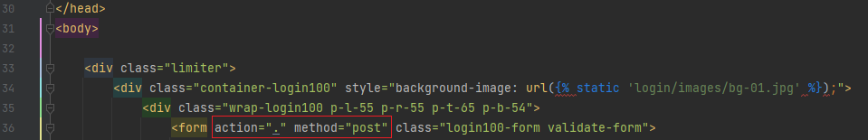

Так как пароль всё же закрытая информация, то передавать всё будем в методе POST, поэтому в форме прописан пост метод.
А `action="."`, что отправляем на свой же адрес, просто тем методом, что объявлен в `method`.

Попробуем теперь зарегистрировать пользователя. `login`, `email` и `password` могут быть любым, главное не пустым. 
А `email` должен соответствовать стандартным правилам `*@*.*` в `*` любые буквы например `a@a.a`.

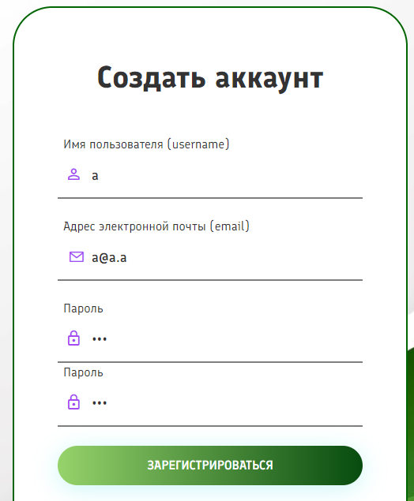

Если отправить запрос на регистрацию, то получим ошибку


Django старается при обработке POST запросов проверить защищенность формы от подмены элементов формы, для этого есть механизм CSRF токенов в Django.

Django просит добавить тег `` в шаблон формы в `signup.html`.

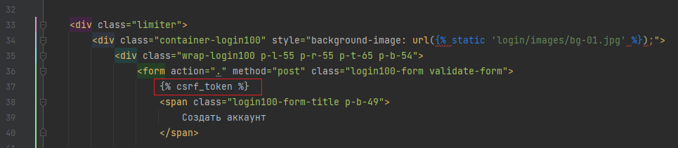

Перезагрузите страницу регистрации (важно перезагрузить страницу, чтобы сервер отослал новый HTML c токеном), 
введите данные вновь. 

Получим новую ошибку, что у нас нет возвращаемого элемента у представления. Проще говоря мы не прописали что делать представлению
в случае обработки POST запросов.

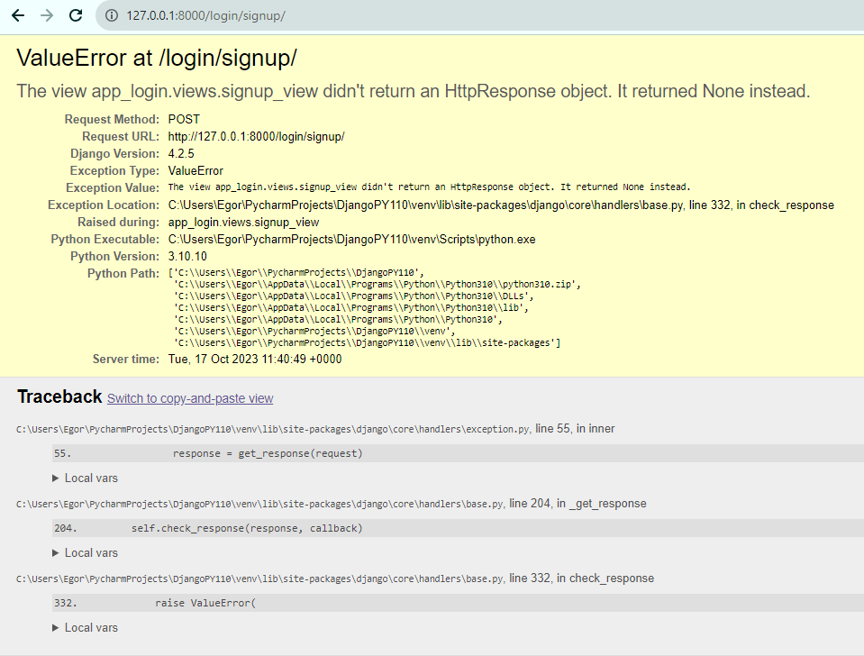

Данные ошибки были вызваны специально, так как на первых порах очень часто забывают при работе с формами прописывать токен и пост обработчик

В `views.py` приложения `app_login` обработчика `signup_view` пропишем

```python
if request.method == "POST":
    data = request.POST
    print(data)
    return redirect("/")
```

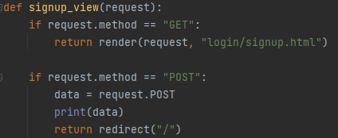

Теперь в при регистрации, вы будете перенаправлены на стартовую страницу.

А в консоле распечатается информация из пришедшей формы 

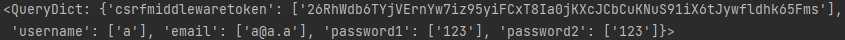

Но пользователя мы так и не зарегистрировали. В Django есть определенные механизмы упрощающие обработку запросов 
для авторизации и регистрации, но на текущем уровне мы про них ничего не знаем. Они будут рассмотрены, но в следующем модуле.

Так что сейчас упростим немного задачу и воспользуемся функциями для работы с пользователями.

Скопируйте файл `auth.py` из `files/lab5` в папку `logic`.  В `auth.py` находятся вспомогательные для нас функции.

Затем `views.py` в `signup_view` пропишем

```python
from logic.auth import check_user_before_registration, add_to_users_database

def signup_view(request):
    if request.method == "GET":
        return render(request, "login/signup.html")

    if request.method == "POST":
        data = request.POST
        result = check_user_before_registration(username=data["username"], email=data["email"],
                                                password1=data["password1"], password2=data["password2"])
        if result["answer"]:
            add_to_users_database(username=data["username"], email=data["email"], password=data["password1"])
            return redirect("/")
        return render(request, "login/signup.html", context={"error": result["error"]})
```

Логика тут следующая:
* Из запроса мы получаем информацию(`request.POST`), ту что передали в форму


* Затем мы проводим валидацию(проверку) данных на требования 
(что пользователя под таким username и email - нет, что пароль нужной защищенности, и то, что пароль и повторный пароль совпадают).
Проверка идёт при помощи функции `check_user_before_registration` загляните в её код и посмотрите, что она делает.
Обычно большинство проверок происходит на стороне клиента (чтобы лишний раз не загружать сервер, так как клиентов многократно 
больше, чем серверов), но фронтенд-разработчик в отпуске, поэтому проверяем данные пользователя на стороне сервера.


* Если на этапе проверок не возникло ошибок, то `add_to_users_database` добавляет пользователя в базу данных
(при этом стоит сделать ремарку, что в базу никогда не добавляется пароль в открытом виде, он всегда изменен и нигде не в базе данных, не на сервере
нет пароля в открытом виде. В `add_to_users_database` для примера трансформации пароль хэшируется при помощи модуля `hashlib` и алгоритмом `sha256`).
Затем перенаправляем на главную страницу.

* Если были ошибки, то добавления не происходит и вы вновь отправляем HTML с регистрационной формой,
но с данными ошибками. Что в `signup.html`, что в `login.html` уже прописан параметр `{{error}}` для возможности отображения 
ошибок в форме при рендринге. 


Проведение валидации данных на практике уделяется много внимания, так как при грамотной
валидации входных данных можно сделать своё приложение более безопасным при сетевых атаках направленных 
на подмену данных и внедрение вредоносного кода с последующим нарушением инфраструктуры.


*Обратите внимание*, проверка `check_user_before_registration` теперь не пропустит слабый пароль, 
чтобы не выдумывать каждый раз сложный пароль можете вносить данный `!QAZXSW2`

Теперь при корректной регистрации мы получим нового пользователя в базе `users.json`.

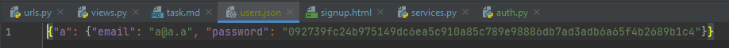


#### 2.3 Авторизация пользователя

Когда в нашей системе один пользователь, то можно было его особо и не регистрировать.
Зарегистрируйте ещё одного пользователя.

Если второго пользователя вы регистрировали под аналогичным паролем, то хэш этих паролей будет идентичен, ведь для этого хеш и нужен.

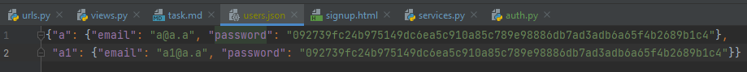

Если требуется необходимость разных хэш значений при одинаковых паролях, то можно просто сделать пароли разными, то
допустим на этапе хэширования можно добавить к началу пароля имя пользователя, а раз имя пользователя в системе уникальное, 
то и хэш значение паролей будут уникальные. Ничего делать не нужно просто информация для расширения кругозора.

Теперь у нас 2 пользователя и стоит задача как между ними переключиться.

Для этого у нас есть `login.html` который предоставляет форму авторизации по логину и паролю.

Самостоятельно добавьте токен `` в шаблон формы в `login.html`, а так же в форме пропишите действие 
и каким методом будет отправлен запрос. 

```html
action="." method="post"
```

Как это сделали, то пропишем POST обработчик для отображения  

```python
from logic.auth import check_user_before_authorization, authenticate

def login_view(request):
    if request.method == "GET":
        return render(request, "login/login.html")

    if request.method == "POST":
        data = request.POST
        result = check_user_before_authorization(username=data["username"], password=data["password"])
        if result["answer"]:
            authenticate(username=data["username"])
            return redirect("/")
        return render(request, "login/login.html", context={"error": result["error"]})
```

Теперь появилась функция `check_user_before_authorization` делающая проверки данных, ту же проверку, что пользователь есть в базе и проверку, 
что введенный пароль совпадает с тем, что есть в БД.

А функция `authenticate` по имени пользователя записывает, какой именно пользователь авторизирован в системе

Остальные подходы аналогичны регистрации.

Теперь мы можем переключаться между пользователями и в `auth_user.json` будет отображаться авторизированный пользователь

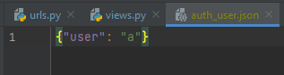

#### 2.4 Отображение авторизированного пользователя в шапке 

Пользователь авторизирован, но не понятно какой именно пользователь авторизирован.

Для этого в навигационную панель шаблона `base.html` добавим пару строк

Вместо 
```html
<li class="nav-item"><a href="" class="nav-link">Войти в аккаунт</a>
```

Поставим 

```html

<li class="nav-item"><a href="" class="nav-link">Выйти из аккаунта</a>
<li class="nav-item"><a class="nav-link">Привет {{user.username}}!</a>

<li class="nav-item"><a href="" class="nav-link">Войти в аккаунт</a>

```

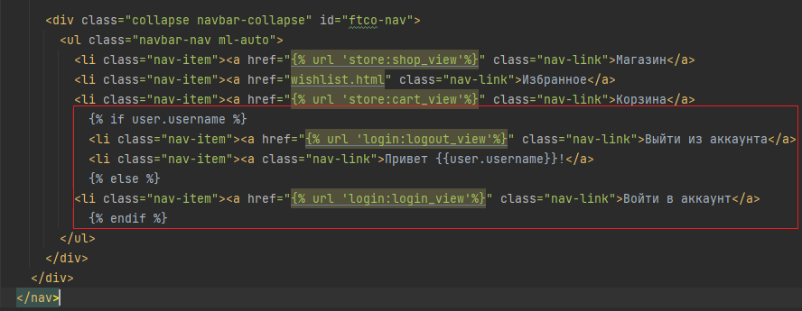

Мы видим, что добавлена строка "Выйти из аккаунта" и тег `` который будет требовать обработчика. 

Вам необходимо самостоятельно написать функцию представление и прописать маршрут зайдя на который можно будет разлогиниться.

Используйте шаблон ниже для функции представления

```python
from logic.auth import logout

def logout_view(request):
    if request.method == "GET":
        logout()  # Функция разлогинивает пользователя
        return ... # TODO Верните редирект на главную страницу
```

Зарегистрируйте маршрут исходя из требований тега ``

Теперь осталось только передать имя пользователя через параметр `user`, но пойдём немного не по привычному маршруту. Дело в том,
что когда мы в `render` первым параметром передавали `request`, то в шаблон при рендеринг также передаются параметры данного
`request`. 

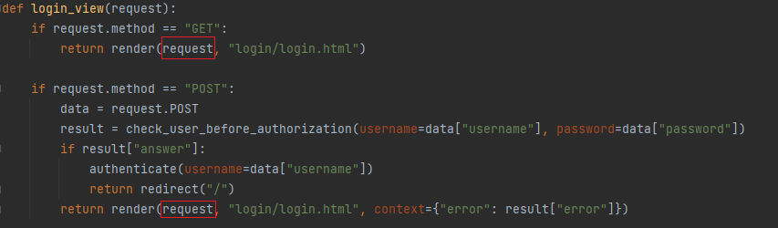

Этим мы и воспользуемся, просто дополним параметры `request`.

Фактически нам нужно будет в каждом отображении, где мы хотим, чтобы передался наш пользователь 
(мы же используем base.html в качестве расширения) добавить параметр в `request`. Ранее вы изучали декораторы, призванные для того,
чтобы облегчить жизнь для добавления вариативности в ваши функции и объекты. 

Напишем такой декоратор, который добавляет параметр в `request` и передаёт её в функцию представление.

В `auth.py` пропишите следующий декоратор

```python
def show_user(view_func):
    def wrapper(request, *args, **kwargs):
        request.user.username = get_current_auth_user()
        return view_func(request, *args, **kwargs)
    return wrapper
```

Что здесь происходит? Здесь в функцию `wrapper` передаём `request` и дополнительные параметры необходимые для запуска функции представления
`view_func`. Затем в `request.user.username` записываем имя авторизированного пользователя и передаём данный `request` в функцию представление.

Затем в приложении `store` во views.py у отображений которые показывают наши страницы 
поставим вызов декоратора `@show_user`

```python
from logic.auth import show_user

@show_user
def shop_view(request):
    ...

@show_user
def cart_view(request):
    ...
```

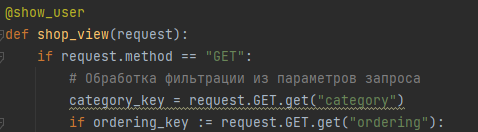


И теперь если зайти на главную страницу или страницу отображения корзины будет показываться имя пользователя, 
пропадет кнопка авторизации, так как пользователь авторизирован, а появится кнопка выхода из аккаунта (если правильно прописали маршрут и представление)

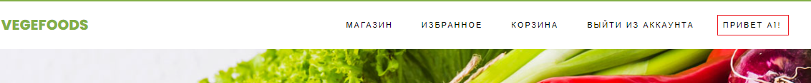

Разлогиньтесь и авторизируйтесь под другим аккаунтом. 

#### 2.5 Связь пользователя и корзины

Теперь нужно подправить корзину, так как при переходе в корзину пользователь 
не связан с корзиной. У нас была описана абстрактная корзина, без привязки пользователя.

Первое, что необходимо сделать, поправить функции `view_in_cart`, `add_to_cart`, 
`remove_from_cart` в `services.py`, чтобы как-то связать пользователя.

Во `view_in_cart` замените прошлую пустую корзину на 

```python
cart = {'products': {}}  # было

# from .auth import get_current_auth_user
user = get_current_auth_user()
cart = {user: {'products': {}}}  # стало
```

В `add_to_cart` произведем замену, чтобы получить корзину авторизированного пользователя.
А записываем мы общую базу, так как частично json изменить нельзя.

```python
cart = view_in_cart()  # было

cart_users = view_in_cart()
cart = cart_users[get_current_auth_user()]  # стало


json.dump(cart, f)  # было
json.dump(cart_users, f)  # стало
```
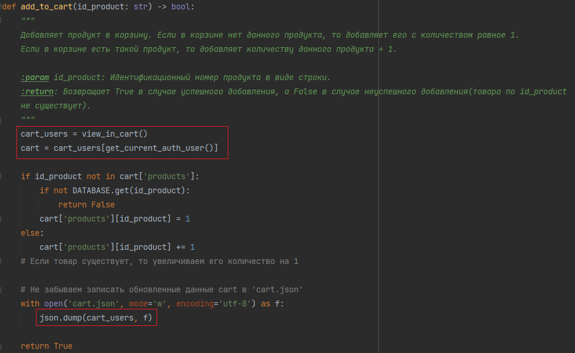

При обработке `remove_from_cart` необходимо сделать аналогичное действие, 
получить корзину авторизированного пользователя. А записываем мы общую базу, так как частично json изменить нельзя.

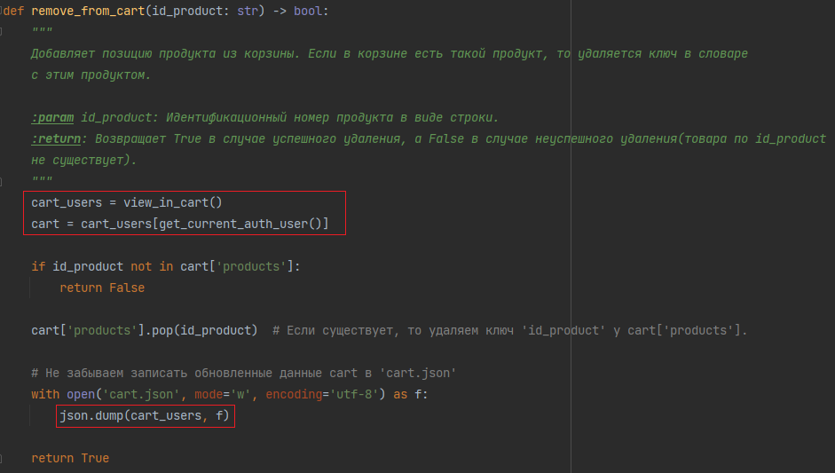

Теперь осталось во `views.py` поменять приложения `store` поправить представление `cart_view`

Ранее у нас было написано `data = view_in_cart()`, но теперь `view_in_cart` возвращает не корзину пользователя, 
а всю базу корзин. По имени пользователя получим корзину.

```python
data = view_in_cart()[request.user.username]
```

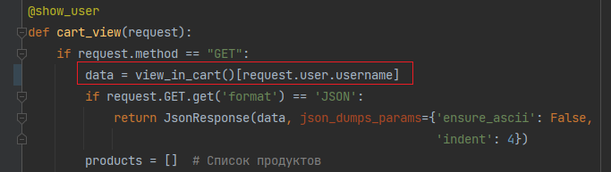

Теперь у нас появилась возможность просматривать корзину авторизированного пользователя.

Но если выйти из аккаунта пользователя, то при добавлении в корзину или при просмотре корзины, мы получаем ошибку, что в базе нет неизвестного пользователя,
для этого база и существует, чтобы его там не было иначе каждый неавторизированный пользователь 
мог бы изменять корзину любого неавторизированного пользователя в системе.

Поэтому реализуем механизм ограничения доступа к определенным действиям на сайте для неавторизированного пользователя.

#### 2.6 Ограничение доступа к определенным частям сайта неавторизированным пользователям

Механизм ограничения доступа будем реализовывать при помощи декораторов и просмотра значения `request.user.username`, если
это значение не пустое, то значит у нас авторизированный пользователь, если пустое, то необходимо перенаправить 
его на форму регистрации.

В `auth.py` пропишем фабрику декораторов `authentication_required` входной параметр `url` будет соответствовать ссылке на представление 
обрабатываемое переход неавторизированного пользователя

Допишите шаблон

```python
def authentication_required(url):
    def login(view_func):  # view_func - функция представление для обработки авторизированного пользователя
        def wrapper(request, *args, **kwargs):
            if get_current_auth_user():
                # TODO Пользователь авторизован, выполняем представление. В представление передаётся request, *args, **kwargs
                return ...
            else:
                # TODO Пользователь не авторизован, перенаправляем его на страницу входа используя url для redirect
                return ...

        return wrapper
    return login
```

Теперь можно использовать данный декоратор на функции представления, перед выполнением которых необходимо проверить 
авторизацию пользователя.

Применим наш декоратор на функцию `cart_view`. Обратите внимание как применяются несколько декораторов.

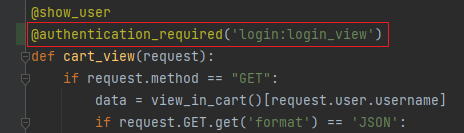

Теперь если пользователь не авторизирован, то при переходе на корзину - пользователя перенаправят на форму авторизации. 
Т.е. при любом вызове обработчика, показывающий корзину, теперь будет требоваться авторизация.

Однако, проверьте, работает ли теперь обыкновенное добавление в корзину с и без перехода, для неавторизированного пользователя?
Видим, что ничего не происходит, а должно отправлять в форму регистрации. 

Добавим декораторы на соответствующие обработчики.

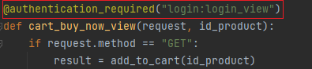

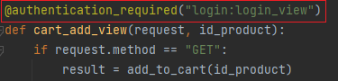

Теперь всё будет работать корректно.

В моменте работы мы упустили один нюанс. При добавлении нового пользователя мы не авторизируемся под ним сразу, поэтому 
при добавлении продукта в корзину. Поправить этот момент оставляю за вами. Найдите где во `views.py` приложения `app_login` 
необходимо авторизировать пользователя при его регистрации.


### 3. Работа с окружением на github

На этом моменте практический материал закончен. 
Произведём подготовку для последующего выполнения зачетного задания.

Так как в рамках нашего модуля не предполагается ознакамливаться с подходами запуска приложения на отдельном сервисе 
или хосте для последующей возможности зайти на сайт по внешней ссылке. То приведу способ на github развернуть проект,
чтобы можно было ознакомиться с работой проекта прямо на гитхаб без клонирования репозитория и запуске проекта на локальной машине.

Такой подход поможет вашим преподавателям практикам ознакомиться и проверить зачетное задание без скачивания вашего проекта.

В данном параграфе будут приведены только комментарии к скриптам настройке окружения на github.


### Практика окончена

Зафиксируем изменения сделав коммит и отправим эти коммиты на github