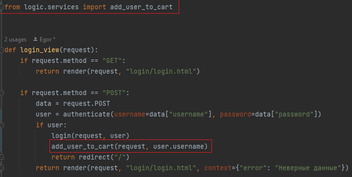

Руководство и задания к 5-ой практике. На практике поработаем с шаблонами и языком шаблонов. Потренируемся
разделять и наследовать шаблоны.

Ранее мы с вами постоянно обращались к адресной строке, чтобы перейти на тот или иной функционал. Но это неудобно когда
переходим часто. Пропишем в нашей навигационной панели переходы, чтобы можно было перемещаться через навигационную панель.

Для этого в `base.html` пропишем ссылки для переходов, воспользуемся тегом ``


Названия обработчиков возьмём из `urls.py` приложения `store` 



Теперь во всех html файлов, где используется `base.html` появились актуальные ссылки для перехода


### 1. Работа с корзиной

Ранее мы реализовали отображение корзины, теперь реализуем определенный функционал в данной корзине.

#### 1.1 Реализация проверки действия купона

Поступил запрос на разработку функционала проверки купона со стороны сервера для применения его к стоимости заказа.

Необходимо реализовать обработчик, который возвращает JSON с данными действителен ли купон и процент скидки 
со стоимости товара.

*Как всё работает на стороне клиента?*

Работа построена на javascript обработчике со стороны клиента, который отравляет `GET запрос` на адрес `http://127.0.0.1:8000/coupon/check/<name_coupon>` , где
`<name_coupon>` код купона, получаемый из HTML формы. Javascript обработчик получает JSON со стороны сервера и проверяет поля
`"is_valid"` и `"discount"`. 

Если `"is_valid"` равно `True` значит купон действительный и можно посмотреть какой у него размер скидки `"discount"`,
после применения купона произойдет пересчет общей стоимости заказа с учетом скидки и под кнопкой проверить появится надпись `f'Купон действителен! Размер скидки: {discount} %'`.

Если `"is_valid"` равно `False`, то под кнопкой проверить появится надпись `'Купон не действителен!'`

Если в JSON вернётся ошибка, то обработчик воспримет, что данного купона не существует и под кнопкой проверить появится 
надпись `'Произошла ошибка при проверке купона'`

Всё что описано, не нужно реализовывать, это уже есть на стороне клиента.

*Что необходимо сделать нам?*

Нам необходимо написать представление, которое обработает входящий запрос и вернёт JSON с ключами `"is_valid"` и `"discount"`,
если такой купон есть в базе, а если его нет то вернет объект `HttpResponseNotFound("Неверный купон")`.

Заполните представление `coupon_check_view`, и доведите его до рабочего состояния

```python
def coupon_check_view(request, name_coupon):
    # DATA_COUPON - база данных купонов: ключ - код купона (name_coupon); значение - словарь со значением скидки в процентах и
    # значением действителен ли купон или нет
    DATA_COUPON = {
        "coupon": {
            "value": 10,
            "is_valid": True},
        "coupon_old": {
            "value": 20,
            "is_valid": False},
    }
    if request.method == "GET":
        # Проверьте, что купон есть в DATA_COUPON, если он есть, то верните JsonResponse в котором по ключу "discount"
        # получают значение скидки в процентах, а по ключу "is_valid" понимают действителен ли купон или нет (True, False)

        # Если купона нет в базе, то верните HttpResponseNotFound("Неверный купон")
```

Представление должно обрабатываться по маршруту `coupon/check/``<``slug:coupon``>` в `urls.py` приложения `store`

Проверить работу можно по маршруту 

http://127.0.0.1:8000/coupon/check/coupon


А в корзине покупок при применении промокода появится следующее.


#### 1.2 Реализация расчёта стоимости доставки

Поступил запрос на разработку функционала расчёта стоимости доставки со стороны сервера для применения данной стоимости 
к стоимости заказа.

Здесь всё, как и в прошлый раз работает javascript, а нам необходимо реализовать обработку запросов.

В этот раз на стороне клиента происходит GET запрос c параметрами по адресу `http://127.0.0.1:8000/delivery/estimate?country=<country>&city=<city>&code=<code>`,
`<country>`, `<city>` и `<code>` - страна, город и почтовый код для доставки соответственно.

На стороне клиента ожидается возвращения JSON с ключом `"price"` значение которого будет соответствовать стоимости доставки.

Если по какой-то причине нельзя рассчитать стоимость доставки, то верните `HttpResponseNotFound("Неверные данные")`

Предлагается заполнить представление `delivery_estimate_view` возвращающее JSON

```python
def delivery_estimate_view(request):
    # База данных по стоимости доставки. Ключ - Страна; Значение словарь с городами и ценами; Значение с ключом fix_price
    # применяется если нет города в данной стране
    DATA_PRICE = {
        "Россия": {
            "Москва": {"price": 80},
            "Санкт-Петербург": {"price": 80},
            "fix_price": 100,
        },
    }
    if request.method == "GET":
        data = request.GET
        country = data.get('country')
        city = data.get('city')
        # Реализуйте логику расчёта стоимости доставки, которая выполняет следующее:
        # Если в базе DATA_PRICE есть и страна (country) и существует город(city), то вернуть JsonResponse со словарём, {"price": значение стоимости доставки} 
        # Если в базе DATA_PRICE есть страна, но нет города, то вернуть JsonResponse со словарём, {"price": значение фиксированной стоимости доставки} 
        # Если нет страны, то вернуть HttpResponseNotFound("Неверные данные")
```

Представление должно обрабатываться по маршруту `delivery/estimate` в `urls.py` приложения `store`

Проверить работу можно по маршруту 

http://127.0.0.1:8000/delivery/estimate?country=Россия


А в корзине покупок при расчёте доставки появится следующее.


#### 1.3 Добавление продуктов в корзину

##### 1.3.1 Добавление без перехода в корзину

Фронтенд разработчик попросил в наш `shop.html` вставить разработанные им javascript код, для добавления товаров в корзину
по нажатии на иконку


но сказал, чтобы всё корректно работало, то необходимо, чтобы в свойстве `data-product-id` содержался 
id товара, который будет добавляться в корзину.

Поможем ему и добавим этот функционал. Для этого обратимся в `shop.html` и добавим блок 

```html



```


Помним, что создали данный блок в `base.html` специально для добавления javascript кода

А уже в данном блоке пропишем тот код фронтенд разработчика

```html
<script>
	// Функция для показа всплывающего сообщения

	function showPopupMessage(productID, message) {
    let popupMessage = document.querySelector(`.custom-popup-message[data-product-id="${productID}"]`);
    popupMessage.textContent = message;
    popupMessage.style.display = 'block';
    setTimeout(function() {
        popupMessage.style.opacity = 1;
    }, 10);
    setTimeout(function() {
        popupMessage.style.opacity = 0;
        setTimeout(function() {
            popupMessage.style.display = 'none';
        }, 250); // Исчезнет через 0.25 секунды
    }, 750); // Показывается в течение 0.75 секунд
}
</script>

<script>
	// Добавление продукта в корзину
	function addToCart(event) {
		// Получаем значение купона, которое вы хотите проверить
		event.preventDefault();
		let linkCart = event.target; // Получаем элемент ссылки, на которой был клик
		// console.log(linkCart)
    	let productId = linkCart.getAttribute('data-product-id'); // Получаем ID товара
		console.log(productId)
		linkCart.disabled = true;

		// Отправляем асинхронный GET-запрос на сервер для проверки купона
		fetch('http://127.0.0.1:8000/cart/add/' + productId, {
			method: 'GET'
		})
		.then(function(response) {
			// Проверяем статус ответа
			if (!response.ok) {
				throw new Error('Ошибка при при добавлении в корзину');
			}
			return response.json();
		})
		.then(function(data) {
			// Обрабатываем данные, которые пришли с сервера

			if (data.answer = 'Продукт успешно добавлен в корзину') {
				showPopupMessage(productId, 'Продукт успешно добавлен в корзину');
			}
		})
		.catch(function(error) {
			// Обрабатываем ошибку
			console.error(error);
		})
		.finally(function() {
			// Включаем ссылку обратно после получения ответа (успешного или с ошибкой)
			linkCart.disabled = false;
		});

	};
	let addButtons = document.querySelectorAll('.add-to-cart');
	addButtons.forEach(function(button) {
		button.addEventListener('click', addToCart);
	});

</script>
```

Но одного кода мало нам необходимо в свойстве `data-product-id` тегов html передать id продукта, так сделаем это

В `shop.html` найдём блок `<div class="m-auto d-flex">` отвечающий за выпадающее меню товара и произведем изменения


Теперь если всё сделано верно, то при нажатии на добавления товара на главной странице появится всплывающее окно,
а товар будет добавлен в корзину.


##### 1.3.2 Добавление товара с переходом в корзину

Реализуем данную функциональность средствами Django.

Что сделаем:

* Создадим представление для обработки запроса на добавление

Для этого используем метод `redirect`, который перенаправляет наш запрос на другой обработчик.
В нашем случае на обработчик занимающийся показом корзины (маршрут `/cart/`)

Создадим представление `cart_buy_now_view`, но предварительно импортируем метод `redirect`

```python
from django.shortcuts import redirect
```

```python
def cart_buy_now_view(request, id_product):
    if request.method == "GET":
        result = add_to_cart(id_product)
        if result:
            return redirect("store:cart_view")

        return HttpResponseNotFound("Неудачное добавление в корзину")
```
Почему мы возвращаем `redirect` на обработчик корзины? Это сделано для уменьшения дублирования кода,
то есть мы делегируем полномочия на другой обработчик. 

Это означает, что после обработке маршрута, мы добавим в корзину, а далее мы не останемся на данном маршруте,
а просто перейдём по маршруту который отображает корзину, так пользователь 
не будет видеть лишние действия со стороны сервера.

* Зарегистрируем маршрут по пути `cart/buy/<str:id_product>`

```python
path('cart/buy/<str:id_product>', cart_buy_now_view, name="buy_now"),
```

* Пропишите обработчик в `shop.html` 

```html
href=""
```

Место для ссылки находится рядом с той кнопкой добавления


Теперь при нажатии на добавление товара с переходом в корзину, происходит ровно то, что и требовалось


*Дополнительно*

Выше в обработчике `cart_buy_now_view` использовали редирект, но а что если передать туда просто вызов другого обработчика,
изменится ли что-то или нет?

Посмотрите разницу между двумя подходами в обработчике `cart_buy_now_view`, когда возвращаем функцию представление,
вместо перенаправления `redirect("store:cart_view")` вернем `cart_view(request)`

```python
def cart_buy_now_view(request, id_product):
    if request.method == "GET":
        result = add_to_cart(id_product)
        if result:
            return cart_view(request)

        return HttpResponseNotFound("Неудачное добавление в корзину")
```

Проанализируйте, что изменилось. 

После анализа верните обратно `redirect("store:cart_view")`, так как данный 
механизм чаще используют.


##### 1.3.3 Удаление продуктов из корзины

С вопросами добавления мы разобрались, но удаление из корзины через адресную строку всё так же неудобно.

Если заглянуть в корзину, то у товаров можно заметить одну особенность, это крестик рядом с картинкой товара.


На крестик можно нажать, но ничего не произойдёт. Используем его для вызова обработчика и удаления позиции из корзины.

Реализуйте самостоятельно механизм удаления из корзины, следуя шагам:

* Реализуйте представление `cart_remove_view`, оно очень похоже на `cart_buy_now_view`, только с уклоном на удаление, а не добавление.

Посмотрите при помощи какой функции вы удаляли продукт из корзины в представлении `cart_del_view` когда работали с JSON.
Используйте эти знания для реализации `cart_remove_view`

``````python
def cart_remove_view(request, id_product):
    if request.method == "GET":
        result = ...  # Вызвать функцию удаления из корзины 
        if result:
            return ...  # Вернуть перенаправление на корзину

        return HttpResponseNotFound("Неудачное удаление из корзины")
``````

* Настройте маршрут на путь `cart/remove/<str:id_product>`

```python
path('cart/remove/<str:id_product>', cart_remove_view, name="remove_now"),
```

* Пропишите обработчик в `cart.html` используя тег `` 
(аналогично как для добавления в корзину с переходом)


Если всё верно прописано, то при нажатии на крестик, будет вызван переход по нужному маршруту,
затем вызван обработчик `cart_remove_view` который перенаправит на отображение корзины после 
удаления товаров из корзины.

Проверьте работоспособность данной функциональности.


### 2. Работа с авторизацией

Вроде бы уже сделано многое, а как авторизоваться на сайте у нас нет, хотя в навигационной панели есть переход к форме авторизации.

Представлений в нашем приложении store большое количество, уже сложно следить за каждым из них, давайте создадим отдельное приложение для
авторизации и регистрации. 

На практике типовые приложения Django для интернет-магазина продуктов могут включать:

* `Каталог`: для управления продуктами, категориями и тегами.
* `Корзина`: для управления выбранными пользователем продуктами.
* `Заказы`: для управления информацией о заказах и статусах.
* `Платежи`: для обработки платежей и интеграции с платежными шлюзами.
* `Аутентификация и авторизация`: для управления пользователями и входом в систему.
* `Уведомления`: для отправки уведомлений пользователям о статусе заказа и другой информации.

#### 2.1 Настройка приложения для авторизации и регистрации

Сделаем ряд действий:

1. Создадим новое приложение `app_login` воспользовавшись командой `python manage.py startapp app_login`.

2. Зарегистрируем приложение в `settings.py` в словаре `INSTALLED_APPS`

3. В приложении создадим папки `static` и `templates`, а в них папку `login`(чтобы чуть сократить название,
хотя по обычаю создавали папку с названием приложения)

4. Скопируем данные в `app_login/static/login` из `files/lab5/static`, а в `app_login/templates/login` скопируйте 
файлы `login.html` и `signup.html` из `files/lab5/`. Также в `app_login` скопируйте с заменой файлы `views.py` и `urls.py` из
`files/lab5/`.

В итоге `app_login` будет выглядеть так


5. В корневом `urls.py` папки `project` пропишем маршрут до приложения `app_login`

```python
path('login/', include('app_login.urls')),
```

6. Для удобства пропишем ссылку в навигационной панели в `base.html` (приложение `store`) на форму авторизации

Самостоятельно пропишите ссылку, посмотрите какой маршрут вызывает отображение авторизационной формы.


#### 2.2 Создание нового пользователя


#### 2.3 Авторизация под пользователем


#### 2.4 Связь пользователя и корзины

пописать декораторы

прикрутить авторизацию


работа с окружением на github

### Практика окончена

Зафиксируем изменения сделав коммит и отправим эти коммиты на github