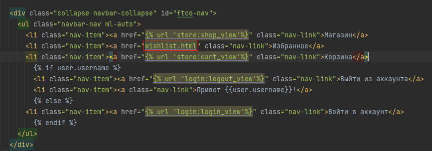
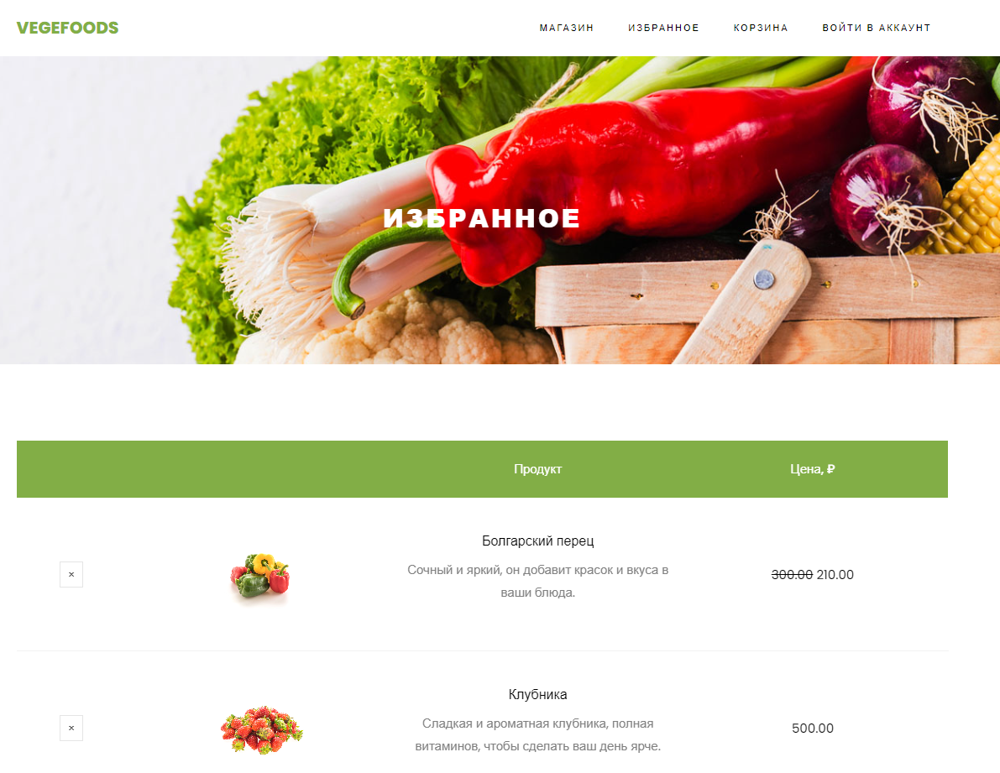

### Зачётное задание

В зачётном задании будет необходимо реализовать функционал избранного по приведенному шаблону.

Шаблон `wishlist.html` приведён в `files/lab6_exam`

На базе того, что мы сделали теперь самостоятельно предстоит разработать функционал избранного. 

Чтобы не разбежались глаза от объёма работы, то будут приведены шаблоны, которые необходимо заполнить. 
Также будет приведен порядок действий.


#### Этап1. Создайте новое приложение wishlist

Помните, что приложение необходимо будет зарегистрировать в словаре `INSTALLED_APPS` файла `settings.py`.

Создайте в папке приложения папку `templates`, а уже в ней папку `wishlist` как делали обычно ранее.

Создайте файл `urls.py` в папке приложения.

#### Этап2. Подключите шаблон wishlist.html

Перенесите шаблон `wishlist.html` из `files/lab6_exam` в `wishlist/templates/wishlist`.

Во `views.py` приложения `wishlist` пропишите представление отображающее избранное

```python
def wishlist_view(request):
    if request.method == "GET":
        ...  # TODO прописать отображение избранного. Путь до HTML - wishlist/wishlist.html
```

Затем в `urls.py` заполните

```python
from django.urls import path
#  TODO Импортируйте ваше представление

app_name = 'wishlist'

urlpatterns = [
    path(..., ..., name=...),  # TODO Зарегистрируйте обработчик
]
```

В корневом `urls.py` папки `projects` зарегистрируйте маршрут приложения

```python
urlpatterns = [
    ...,
    path(..., include(...)),  # TODO Зарегистрируйте маршруты приложения так чтобы обработчик избранного обрабатывался по пути /wishlist/
    ...,
]
```

Проверьте работоспособность маршрута http://127.0.0.1:8000/wishlist/

В `base.html` приложения `store` в навигационной панели пропишите ссылку, для перехода в избранное по ссылке.



#### Этап3. Настройте шаблон wishlist.html

Мы видим, что у `wishlist.html` аналогичная структура, что и у `cart.html`, `shop.html`, поэтому приведите к блоковым элементам как `shop.html` и `cart.html`

```html
 <!-- Расширение не меняем, оно нормально подтянется-->


 <!-- Блок для названия страницы-->
<title>Избранное</title>


 
    <!-- Оформите здесь код уникального содержимого из wishlist.html как делали в cart.html или shop.html-->

```

Затем, где это требуется, запишите тег `static` у статических объектов шаблона `wishlist.html`

Оформление тега `static` ничем не отличается от подходов в `cart.html`, `shop.html`. Так как что там, что там вы прописывали, что
поиск статических файлов будет в приложении `store`, а там они и находятся.

Затем после того, как ваше избранное стало нормально отображаться, настало поработать с базой для хранения товаров в избранном.



База будет храниться в `wishlist.json` аналогично, как и в `cart.json` поэтому можете смело продублировать обработчики 
`view_in_cart`, `add_to_cart`, `remove_from_cart` из `logic/services.py`. Данные обработчики переименуйте, чтобы было понятно,
что происходит работа с избранным и внутреннее содержание поменяйте, чтобы понятно, что это не для корзины, а для избранного.

После создания `view_in_wishlist`, `add_to_wishlist`, `remove_from_wishlist` в `logic/services.py` далее допишите представление `wishlist_view`
во `views.py` приложения `wishlist`. Необходимо, чтобы в шаблон `wishlist.html` передавались продукты, что находятся в избранном.
Получить эти продукты вы можете из написанной вами функции `view_in_wishlist` из `logic/services.py`.

```python
def wishlist_view(request):
    if request.method == "GET":
        data = ... # TODO получить продукты из избранного для пользователя
        
        products = []
        # TODO сформировать список словарей продуктов с их характеристиками

        return render(request, 'wishlist/wishlist.html', context={"products": products})
```


#### Этап4. Настройте добавление и удаление продукта в избранное


#### Этап5. Разграничение доступа пользователя

Сделайте так, чтобы добавить и зайти в избранное можно было только авторизированному пользователя. 
Посмотрите как была сделана аналогичная задача с корзиной.

Не забудьте проконтролировать, что при создании нового пользователя у него должна образоваться запись в базе про его список избранного.
Аналогично как с корзиной.


#### Этап6. Проверьте результат работы вашего функционала


[//]: # (### 3. Работа с окружением на github)

[//]: # ()
[//]: # (На этом моменте практический материал закончен. )

[//]: # (Произведём подготовку для последующего выполнения зачетного задания.)

[//]: # ()
[//]: # (Так как в рамках нашего модуля не предполагается ознакамливаться с подходами запуска приложения на отдельном сервисе )

[//]: # (или хосте для последующей возможности зайти на сайт по внешней ссылке. То приведу способ на github развернуть проект,)

[//]: # (чтобы можно было ознакомиться с работой проекта прямо на гитхаб без клонирования репозитория и запуске проекта на локальной машине.)

[//]: # ()
[//]: # (Такой подход поможет вашим преподавателям практикам ознакомиться и проверить зачетное задание без скачивания вашего проекта.)

[//]: # ()
[//]: # (В данном параграфе будут приведены только комментарии к скриптам настройке окружения на github. )

[//]: # (Для интересующихся в полной мере с настройкой контейнера с окружением можно ознакомиться в [руководстве]&#40;https://docs.github.com/ru/codespaces/setting-up-your-project-for-codespaces/adding-a-dev-container-configuration/setting-up-your-python-project-for-codespaces&#41;.)

